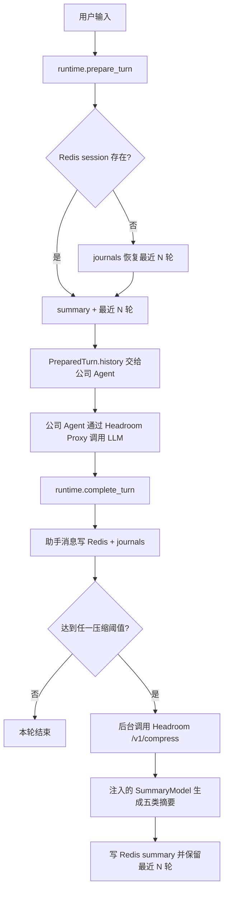

# short-term-memory

`short-term-memory` 是一个可独立安装、供公司 Agent 调用的 Python SDK。它只负责：

- 用 Redis 保存当前 `user_id + session_id` 的短期上下文；
- 用 journals JSONL 保存完整用户/助手事件；
- Redis 过期后按同一 session 从 journals 恢复最近 N 轮；
- 每轮结束后检查 token 比例、消息数和 session 时长阈值；
- 达到阈值时异步调用官方 Headroom HTTP 服务；
- 调用注入的 SummaryModel 生成五类 session summary，并只写 Redis；
- 向公司 Agent 提供回答前后的稳定 Python 调用边界。

它不实现聊天 HTTP 接口、最终回答模型、历史会话 UI、中长期检索、用户画像、AI 决策卡、
Wiki 或 Daily Memory Job。


## 运行链路



Headroom 决定具体压缩器、Router 行为和官方 CCR；本 SDK 只决定何时触发、保存结果并提供
稳定的匿名 scope。Redis summary 是短期缓存，不是长期事实源，也不会写入 Wiki。

## 安装

```bash
python3.13 -m venv .venv
.venv/bin/python -m pip install -e ".[dev]"
```

Redis 和 Headroom 都是外部服务，不会被嵌入 wheel。

```bash
docker compose -f compose.redis.yml up -d

uv tool install --python 3.13 "headroom-ai[all]==0.33.0"
HEADROOM_CCR_TTL_SECONDS=43200 headroom proxy \
  --host 127.0.0.1 \
  --port 8787 \
  --mode token
```

## 配置

复制 `.env.example`。生产环境必须明确配置：

```dotenv
SHORT_TERM_MEMORY_ENV=production
SHORT_TERM_MEMORY_SCOPE_SECRET=replace-with-a-production-secret
REDIS_URL=redis://127.0.0.1:6379/0
HEADROOM_SERVICE_URL=http://127.0.0.1:8787
```

默认 Redis TTL 为 `43200` 秒。Headroom 触发比例必须位于 `0.60`–`0.70`，默认 `0.65`。
development 允许 Headroom 失败时使用原始 messages 继续生成 summary；production 失败时
不调用 SummaryModel、不写 summary、不裁剪 Redis，并保留 Redis 原文和 journals 等待重试。

## 公司 Agent 调用边界

```python
from concurrent.futures import ThreadPoolExecutor
from pathlib import Path

from redis import Redis

from short_term_memory import build_runtime
from short_term_memory.config import load_settings


settings = load_settings(Path(".env"))
runtime = build_runtime(
    home=Path(settings.home).expanduser(),
    settings=settings,
    redis_client=Redis.from_url(settings.redis_session.url),
    token_estimator=company_token_estimator,
    summary_model=company_session_summary_model,
    executor=ThreadPoolExecutor(max_workers=2),
    retry_queue=company_background_retry_queue,
)

# 回答前：恢复/读取 Redis 短期记忆，写入本轮用户消息。
prepared = runtime.prepare_turn(
    user_id="user-001",
    session_id="session-001",
    content="继续刚才的 Redis 设计",
    session_seconds=1800,
)

# 公司 Agent 使用 prepared.history 生成回答；若希望使用官方透明 CCR，
# 实际模型请求必须使用 prepared.headroom_proxy_url 和 prepared.headroom_headers。
assistant_text = company_agent_generate(
    messages=list(prepared.history),
    base_url=prepared.headroom_proxy_url,
    default_headers=prepared.headroom_headers,
)

# 回答后：写助手原文，并在达到阈值时异步投递压缩任务。
result = runtime.complete_turn(
    prepared,
    assistant_content=assistant_text,
)
```

公开根 API 只有：

```python
from short_term_memory import (
    CompletionResult,
    PreparedTurn,
    ShortTermMemorySettings,
    build_runtime,
)
```

## Redis 和 journals

Redis key 保持既有前缀：

```text
dream:session:{user_id}:{session_id}:messages
dream:session:{user_id}:{session_id}:summary
```

journals 路径保持既有兼容格式：

```text
{SHORT_TERM_MEMORY_HOME}/{user_id}/journals/{YYYY-MM-DD}-{session_id}.jsonl
```

正常回答只读取 Redis。只有 Redis session 过期时才从 journals 恢复最近 N 轮；更早历史
通过后台任务重建 summary，不在在线请求中加载全量日志。

## 测试

不依赖外部服务：

```bash
PYTHONPATH=src .venv/bin/python -m pytest -q
.venv/bin/python -m ruff check src tests
```

真实 Redis：

```bash
SHORT_TERM_MEMORY_RUN_REDIS_INTEGRATION=1 \
REDIS_URL=redis://127.0.0.1:6379/15 \
PYTHONPATH=src .venv/bin/python -m pytest -q -s \
tests/integration/test_redis_session_context.py
```

真实 Headroom 自动路由：

```bash
SHORT_TERM_MEMORY_RUN_HEADROOM_AUTO_ROUTING=1 \
HEADROOM_SERVICE_URL=http://127.0.0.1:8787 \
PYTHONPATH=src .venv/bin/python -m pytest -q -s \
tests/integration/test_headroom_auto_routing.py
```

官方 Proxy/CCR 验收：

```bash
SHORT_TERM_MEMORY_RUN_HEADROOM_PROXY_CCR=1 \
SHORT_TERM_MEMORY_HEADROOM_BINARY="$HOME/.local/bin/headroom" \
PYTHONPATH=src .venv/bin/python -m pytest -q -s \
tests/integration/test_headroom_proxy_ccr_flow.py
```

单独调用 `/v1/compress` 只能证明压缩接口工作。只有真实模型请求经过同一 Headroom Proxy
和匿名 scope，并由官方服务完成检索工具续跑，才能证明 CCR 透明召回链路通过。

详细实现与边界见 [docs/short-term-memory.md](docs/short-term-memory.md)。
