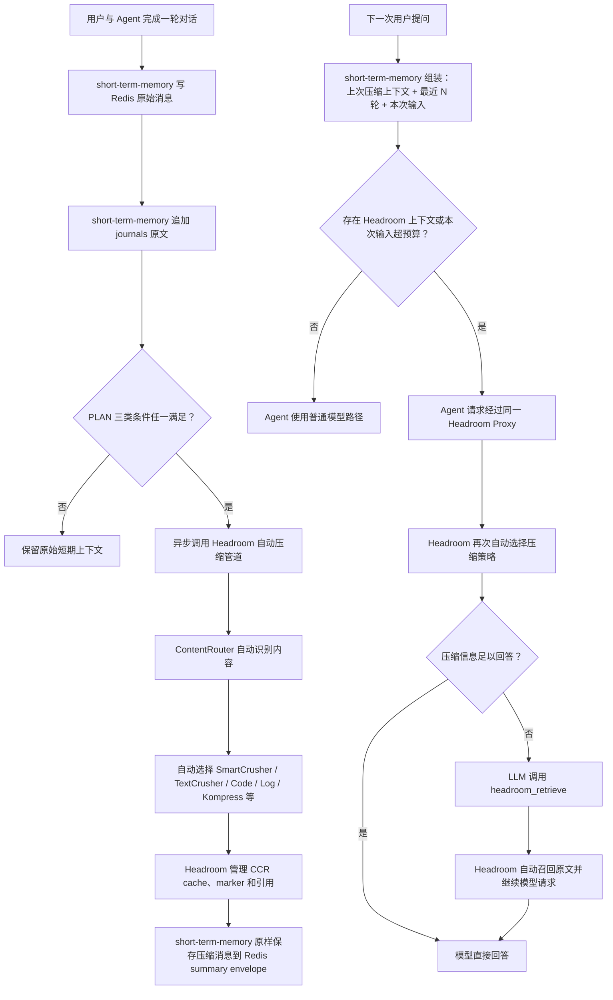

# short-term-memory

`short-term-memory` 是一个面向大模型与 AI Agent 的短期记忆管理模块。

它使用 Redis 保存当前 session 的在线上下文，包括最近消息、summary 和恢复状态；
使用 journals JSONL 作为完整对话事件日志，保存原始会话记录。

当 session 上下文达到 PLAN 定义的触发条件（token 数量、消息数量或 session 时长）时，
short-term-memory 调用官方 Headroom 服务进行上下文优化。
压缩策略、CCR 可逆缓存以及后续原文召回均由 Headroom 管理。

Agent 接入层在生成回答前调用 `prepare_turn()` 获取当前 session 上下文，
在回答完成后调用 `complete_turn()` 写回 assistant 消息并更新短期记忆状态。

| 职责 | 实现 |
|---|---|
| 在线短期上下文 | Redis Session Context |
| 完整经历记录 | journals JSONL |
| 上下文压缩 | 外部 Headroom Service |
| 五类 session 摘要 | 公司注入的 SummaryModel |
| 最终回答 | 公司自己的 LLM / Agent |

本项目只覆盖短期记忆，不包含历史会话窗口、Memory Retrieval Skill、用户画像、AI 决策卡、
Wiki、索引或 Daily Memory Job。

## 架构

左侧链路描述一轮对话
结束后的后台预压缩；右侧链路描述下一次用户提问时的上下文读取、模型调用和官方 CCR
按需召回。



两条链路分别表达“上一轮结束后预计算下一轮上下文”和“下一轮真实 Agent 请求”。
`short-term-memory` 负责 Redis、journals、压缩触发和 summary；Headroom 负责内容识别、
压缩器选择及其官方 CCR；公司 Agent 负责最终模型请求和回答。

## 依赖与调用方式

| 组件 | 版本/形式 | 作用 | 部署位置 |
|---|---|---|---|
| short-term-memory | Python package `0.1.0` | Redis/journals 编排、触发、summary | 公司 Agent 进程内 |
| Redis Server | `7.2.15` | 当前 session messages 和 summary | 外部服务 |
| redis-py | `6.4.0` | Redis 连接池、事务和数据命令 | 项目 Python 环境 |
| Headroom | `headroom-ai[all]==0.33.0` | 自动压缩、Proxy、官方 CCR | 独立 `uv tool` 进程 |
| SummaryModel | 公司注入 | 提取五类 session 摘要 | 公司模型服务/adapter |
| 最终 LLM/Agent | 公司自研 | 使用短期上下文生成回答 | 公司 Agent 系统 |

### Redis 是怎么调用的

Redis Server 独立部署，`short-term-memory` 不复制或运行 Redis 源码。Python 侧通过
`redis==6.4.0` 调用：

```python
from short_term_memory.storage.redis_runtime import RedisRuntime

redis_runtime = RedisRuntime.connect("redis://127.0.0.1:6379/0")

runtime = build_runtime(
    # 其他公司侧依赖省略
    redis_client=redis_runtime.client,
    ...
)
```

`RedisRuntime.connect()` 使用 `redis.ConnectionPool.from_url()` 创建连接池，构造
`redis.Redis` 客户端并执行 `PING`。该客户端注入 `build_runtime()` 后，由
`RedisSessionContext` 调用：

| 场景 | Redis 调用 |
|---|---|
| 写用户/助手消息 | transaction pipeline：`RPUSH` + `EXPIRE` |
| 读取最近 N 轮 | `LRANGE` |
| 检查 session 是否存在 | `EXISTS` |
| 读取 summary | `GET` |
| 获取压缩快照 | `LRANGE` + `LLEN` |
| 写 summary 并保留最近 N 轮 | transaction pipeline：`SET EX` + `LTRIM` + `EXPIRE` |
| 删除 session | `DEL` messages key 和 summary key |

正常回答只读取 Redis。只有 Redis session 过期时，组件才根据同一 `user_id + session_id`
从 journals 恢复最近 N 轮。

### Headroom 是怎么调用的

Headroom 作为独立 HTTP/Proxy 服务运行，`short-term-memory` 不 `import headroom`，也不包含
Kompress、ONNX、PyTorch 等模型依赖。调用分为两条路径：

1. **回答后的后台压缩**：`SessionCompressionJob` 调用 `HeadroomHttpClient`，向
   `POST {HEADROOM_SERVICE_URL}/v1/compress` 发送保持 message boundary 的历史消息和
   HMAC 去标识化 scope headers。返回的 messages 原样进入 Redis summary envelope。
2. **下一轮真实模型请求**：`prepare_turn()` 返回
   `headroom_proxy_url={HEADROOM_SERVICE_URL}/v1` 和同一组 `headroom_headers`。公司 Agent
   把实际 OpenAI-compatible 请求发往该 Proxy，Headroom 再转发到上游模型，并在官方
   支持范围内处理压缩与 CCR。

```text
公司 Agent 进程
  ├─ short-term-memory ── redis-py ───────────────> Redis Server
  ├─ 后台 SessionCompressionJob ── /v1/compress ─> Headroom Service
  └─ 实际 LLM 请求 ── /v1/chat/completions ──────> Headroom Proxy ──> 上游模型
```

Headroom 自己决定使用 ContentRouter、SmartCrusher、文本/代码/日志压缩器或 Kompress；
本项目只决定何时触发，并通过 `CompressionClient` 保持压缩服务可替换。

## 项目结构

```text
.
├── src/short_term_memory/
│   ├── __init__.py                       # 稳定公开 API
│   ├── config.py                         # 环境变量和运行设置
│   ├── models.py                         # PreparedTurn、summary、压缩结果模型
│   ├── ports.py                          # 公司适配器与外部组件 Protocol
│   ├── api/
│   │   ├── conversation_handler.py       # 回答前/回答后会话编排
│   │   └── runtime.py                    # build_runtime 与运行时 facade
│   ├── storage/
│   │   ├── redis_runtime.py              # redis-py 连接生命周期
│   │   ├── redis_session_context.py      # Redis session、TTL、history、恢复
│   │   ├── journal_store.py              # 按 session 追加/读取 JSONL
│   │   └── vfs_adapter.py                # 用户隔离 journals 目录
│   ├── compression/
│   │   ├── headroom_client.py            # POST /v1/compress HTTP adapter
│   │   ├── policy.py                     # PLAN 三类 OR 触发条件
│   │   ├── scope.py                      # HMAC 去标识化 Headroom scope
│   │   ├── summary.py                    # 五类短期摘要生成与校验
│   │   └── telemetry.py                  # 无对话正文的指标状态
│   └── jobs/
│       └── session_compression_job.py    # 后台压缩、摘要、写 Redis、重试
├── tests/
│   ├── api/                              # Agent SDK 测试
│   ├── storage/                          # Redis/journals 单元测试
│   ├── compression/                      # Headroom adapter/policy/summary 测试
│   ├── jobs/                             # 后台任务测试
│   └── integration/                      # opt-in 真实服务测试
├── compose.redis.yml
├── .env.example
└── pyproject.toml
```

## 快速开始

### 1. 获取并安装项目

要求 Python 3.11–3.13、Docker 和 `uv`。

```bash
git clone --branch short-term-memory --single-branch \
  https://github.com/ZCDu/AGFS-MEM.git short-term-memory
cd short-term-memory

python3.13 -m venv .venv
.venv/bin/python -m pip install -e ".[dev]"
```

也可以安装已经构建的 wheel：

```bash
.venv/bin/python -m pip install dist/short_term_memory-0.1.0-py3-none-any.whl
```

### 2. 启动 Redis

仓库提供 `compose.redis.yml`，使用 `redis:7.2.15-bookworm`：

```bash
docker compose -f compose.redis.yml up -d
docker compose -f compose.redis.yml exec redis redis-cli ping
```

预期返回：

```text
PONG
```

停止服务：

```bash
docker compose -f compose.redis.yml down
```

### 3. 安装并启动 Headroom

Headroom 是独立、可替换的本地进程，不安装进 `short-term-memory` 的 `.venv`。推荐使用
`uv tool` 创建隔离环境：

```bash
uv tool install --python 3.13 "headroom-ai[all]==0.33.0"
headroom --version
```

启动官方 Proxy：

```bash
HEADROOM_CCR_TTL_SECONDS=43200 headroom proxy \
  --host 127.0.0.1 \
  --port 8787 \
  --mode token
```

在另一个终端检查：

```bash
curl http://127.0.0.1:8787/health
headroom doctor
```

本项目不指定 `--compressor`。ContentRouter 会根据普通文本、JSON/tool output、代码或日志
自动选择 Headroom 当前版本提供的压缩策略；Kompress 只是其中一种。

### 4. 创建配置

```bash
cp .env.example .env
```

本地开发的最小配置：

```dotenv
SHORT_TERM_MEMORY_ENV=development
SHORT_TERM_MEMORY_HOME=~/.dream
SHORT_TERM_MEMORY_SCOPE_SECRET=development-only-scope-secret
REDIS_URL=redis://127.0.0.1:6379/0
HEADROOM_SERVICE_URL=http://127.0.0.1:8787
```

生产环境必须显式设置：

```dotenv
SHORT_TERM_MEMORY_ENV=production
SHORT_TERM_MEMORY_SCOPE_SECRET=replace-with-a-production-secret
HEADROOM_SERVICE_URL=http://127.0.0.1:8787
```

生产环境缺少 Headroom URL 或 scope secret 时，配置加载会直接失败，不会静默降级。

### 5. 接入公司大模型或 Agent

公司 Agent 需要提供四个适配对象：

- `token_estimator`：实现 `estimate(messages) -> int`，使用公司模型对应的 tokenizer。
- `summary_model`：实现 `summarize(messages)`，输出五类 `SessionSummaryPayload`。
- `executor`：提供 `submit(function, *args)`，用于后台执行压缩和摘要。
- `retry_queue`：提供 `schedule(...)`，用于 Headroom 或摘要失败后的异步重试。

以下代码展示完整调用边界：

```python
from concurrent.futures import ThreadPoolExecutor
from pathlib import Path

from short_term_memory import build_runtime
from short_term_memory.config import load_settings
from short_term_memory.storage.redis_runtime import RedisRuntime


settings = load_settings(Path(".env"))
redis_runtime = RedisRuntime.connect(settings.redis_session.url)

runtime = build_runtime(
    home=Path(settings.home).expanduser(),
    settings=settings,
    redis_client=redis_runtime.client,
    token_estimator=company_token_estimator,
    summary_model=company_session_summary_model,
    executor=ThreadPoolExecutor(max_workers=2),
    retry_queue=company_background_retry_queue,
)

# 回答前：读取当前 session；Redis 过期时从 journals 恢复最近 N 轮；
# 然后写入本轮用户消息并返回可直接交给 Agent 的 history。
prepared = runtime.prepare_turn(
    user_id="user-001",
    session_id="session-001",
    content="继续刚才的 Redis 设计",
    session_seconds=1800,
)

# 最终回答由公司 Agent 生成。
assistant_text = company_agent_generate(
    messages=list(prepared.history),
    base_url=prepared.headroom_proxy_url,
    default_headers=prepared.headroom_headers,
)

# 回答后：助手消息写 Redis + journals；达到任一阈值时异步调用 Headroom。
result = runtime.complete_turn(
    prepared,
    assistant_content=assistant_text,
)

print("headroom queued:", result.headroom_queued)
redis_runtime.close()
```

如果公司 Agent 使用 OpenAI-compatible SDK，并希望使用 Headroom 的实时 Proxy/CCR 路径，
模型请求应使用 `PreparedTurn` 提供的 URL 和匿名 headers：

```python
from openai import OpenAI


agent_client = OpenAI(
    api_key=company_model_api_key,
    base_url=prepared.headroom_proxy_url,
    default_headers=prepared.headroom_headers,
)

response = agent_client.chat.completions.create(
    model=company_model,
    messages=list(prepared.history),
    tools=company_agent_tools,
)
assistant_text = response.choices[0].message.content or ""

runtime.complete_turn(prepared, assistant_content=assistant_text)
```

`openai` SDK 属于公司 Agent 的依赖，不是 `short-term-memory` 的运行依赖。若使用 Anthropic
或其他供应商，应在公司 Agent adapter 中使用对应的 Headroom Proxy 路径，但
`prepare_turn()` / `complete_turn()` 边界不变。

## 核心接口

### `build_runtime(...)`

组装 Redis Session Context、JournalStore、Headroom HTTP adapter、触发策略、后台任务和
telemetry。所有公司相关实现都通过参数注入。

### `runtime.prepare_turn(...) -> PreparedTurn`

回答前调用，执行：

1. 根据 `user_id + session_id` 检查 Redis。
2. Redis 已过期时，从 journals 恢复该 session 最近 N 轮。
3. 读取 Redis session summary 和最近消息。
4. 写入本轮用户消息到 Redis 和 journals。
5. 返回 `history`、`headroom_proxy_url` 和去标识化 `headroom_headers`。

正常在线路径只从 Redis 读取短期记忆，不默认访问中长期存储。

### `runtime.complete_turn(...) -> CompletionResult`

公司 Agent 生成回答后调用，执行：

1. 写助手消息到 Redis 和 journals。
2. 获取当前 Redis compression snapshot。
3. 检查 PLAN 三类触发条件。
4. 达到任一条件时把 Headroom + SummaryModel 工作提交到后台 executor。

`headroom_queued=True` 只代表已投递后台任务，不代表 Headroom 一定应用了压缩 transform。

## Redis、journals 与 summary

### Redis key

为了保持现有数据兼容，key 前缀继续使用 `dream`：

```text
dream:session:{user_id}:{session_id}:messages
dream:session:{user_id}:{session_id}:summary
```

- `messages`：Redis List，保存当前 session 最近原文消息。
- `summary`：Redis String，保存五类语义和 Headroom 压缩上下文 envelope。
- 默认 TTL：`43200` 秒，即 12 小时。
- 每次写消息都会刷新 messages 和 summary TTL。

Redis 只保存在线短期状态，可以过期；它不是长期事实源。

### journals

完整事件按用户、日期和 session 写入：

```text
{SHORT_TERM_MEMORY_HOME}/{user_id}/journals/{YYYY-MM-DD}-{session_id}.jsonl
```

消息事件：

```json
{
  "type": "message",
  "timestamp": "2026-08-04T12:00:00+00:00",
  "role": "user",
  "content": "继续刚才的 Redis 设计"
}
```

文件事件：

```json
{
  "type": "file",
  "timestamp": "2026-08-04T12:00:00+00:00",
  "original_url": "https://example.com/plan.pdf",
  "local_path": "raw/plan.pdf"
}
```

journals 是完整经历记录。正常回答不读取 journals；只有 Redis session 过期时，组件才按
同一 `session_id` 恢复最近 N 轮，更早内容异步投递重建，避免在线加载几十万 token。

### Session summary

Headroom 负责降低 token，注入的 SummaryModel 负责生成 PLAN 要求的五类语义：

```text
current_goal
preferences
confirmed_facts
pending_items
attachment_references
```

Redis summary envelope 示例：

```json
{
  "user_id": "user-001",
  "session_id": "session-001",
  "coverage": {"processed_message_count": 120},
  "current_goal": ["完成短期记忆接入"],
  "preferences": ["优先使用 Python SDK"],
  "confirmed_facts": ["Redis TTL 为 12 小时"],
  "pending_items": ["完成真实供应商 CCR 验收"],
  "attachment_references": [],
  "compression_context": {
    "messages": [],
    "tokens_before": 10000,
    "tokens_after": 6000
  },
  "updated_at": "2026-08-04T12:00:00+00:00"
}
```

summary 只写 Redis，不进入 Wiki，也不能代替 journals 原文。

## Headroom 压缩与 CCR

### DREAM 决定何时触发

每轮结束后检查三个 OR 条件：

```text
estimated_tokens >= context_window_tokens * trigger_ratio
OR message_count >= max_messages
OR session_seconds >= max_session_seconds
```

- `trigger_ratio` 必须在 `0.60`–`0.70`，默认 `0.65`。
- 默认消息数阈值为 `100`。
- 默认 session 时长阈值为 `14400` 秒。

### Headroom 决定如何压缩

后台任务调用：

```http
POST {HEADROOM_SERVICE_URL}/v1/compress
Content-Type: application/json
X-Headroom-User-Id: <HMAC scope>
X-Headroom-Session-Id: <HMAC scope>
X-Headroom-Project-Id: <HMAC scope>

{
  "model": "gpt-4o",
  "messages": [
    {"role": "user", "content": "..."},
    {"role": "assistant", "content": "..."}
  ]
}
```

组件保持 message boundary，不把整个 session 拼成一个大字符串，也不自行选择 Router、
Kompress 或 SmartCrusher。Headroom 返回的 messages 作为不透明协议对象保存。

### 官方 CCR 边界

后台压缩与实时 Agent 请求使用同一组 `dream-v1` HMAC scope headers。公司 Agent 把真实
模型请求发送到 `PreparedTurn.headroom_proxy_url` 后，Headroom 才有条件负责 marker、
相关性判断、`headroom_retrieve` 和供应商支持的自动续跑。

当前已经接通这一 Proxy/scope 边界，但必须区分：

- `/v1/compress` token 下降：证明压缩工作。
- 返回 CCR marker/hash：证明原文进入 Headroom CCR 协议。
- 模型自动调用 `headroom_retrieve` 并继续回答：才证明透明召回完成。

目前 Headroom 0.33.0 假 OpenAI 上游验收中，压缩和 CCR 引用已经产生，但官方 Proxy 没有
自动完成第二次续跑。因此 README 不把透明 CCR 写成“已完全验收”。journals 仍是长期、
精确和可审计的原文保障。

## 配置

| 环境变量 | 默认值 | 说明 | production |
|---|---:|---|---|
| `SHORT_TERM_MEMORY_HOME` | `~/.dream` | journals 数据根目录 | 可选 |
| `SHORT_TERM_MEMORY_ENV` | `development` | `development` / `production` | 必须设为 `production` |
| `SHORT_TERM_MEMORY_SCOPE_SECRET` | 开发默认值 | 生成匿名 Headroom scope | 必填 |
| `REDIS_URL` | `redis://127.0.0.1:6379/0` | Redis 连接 URL | 按部署配置 |
| `REDIS_SESSION_TTL_SECONDS` | `43200` | messages/summary TTL | 可选 |
| `REDIS_HISTORY_TURNS` | `10` | 在线保留最近 N 轮 | 可选 |
| `CONTEXT_WINDOW_TOKENS` | `128000` | Agent 模型上下文窗口 | 按模型配置 |
| `HEADROOM_TRIGGER_RATIO` | `0.65` | token 触发比例，范围 0.60–0.70 | 可选 |
| `HEADROOM_MAX_MESSAGES` | `100` | Redis 消息数阈值 | 可选 |
| `HEADROOM_MAX_SESSION_SECONDS` | `14400` | session 时长阈值 | 可选 |
| `HEADROOM_SERVICE_URL` | 空 | Headroom 服务根 URL | 必填 |
| `HEADROOM_SERVICE_TIMEOUT_SECONDS` | `300` | `/v1/compress` 超时 | 可选 |
| `HEADROOM_COMPRESSION_MODEL` | `gpt-4o` | 原样传给 Headroom 的模型名 | 按 Agent 配置 |
| `HEADROOM_CCR_TTL_SECONDS` | `43200` | 压缩上下文可附加时长 | 与 Headroom 服务一致 |

进程环境变量优先于 `.env` 文件中的同名值。

## 容错与可观测性

### Development

Headroom 服务不可用、超时或响应非法时：

- 使用原始 messages 作为 fallback，继续调用 SummaryModel。
- `fallback_used=true`。
- 输出不包含完整对话正文的 warning。

### Production

Headroom 调用失败时：

- 不把错误暴露给最终 Agent 用户。
- 不调用 SummaryModel。
- 不写 Redis summary。
- 不执行 LTRIM，不删除 Redis 原始消息。
- 保留 Redis 和 journals，交给异步 RetryQueue。

默认 `InMemoryHeadroomTelemetry` 提供以下指标，可替换为企业监控 adapter：

```text
headroom_compression_success_count
headroom_compression_failure_count
headroom_fallback_count
headroom_noop_count
headroom_compression_ratio
headroom_context_attached_count
headroom_scope_generation_failure_count
```

指标和日志不记录用户消息正文。

## 测试

### 不依赖外部服务

```bash
PYTHONPATH=src .venv/bin/python -m pytest -q
.venv/bin/python -m ruff check src tests
```

### 真实 Redis

```bash
SHORT_TERM_MEMORY_RUN_REDIS_INTEGRATION=1 \
REDIS_URL=redis://127.0.0.1:6379/15 \
PYTHONPATH=src .venv/bin/python -m pytest -q -s \
tests/integration/test_redis_session_context.py
```

### 真实 Headroom 自动路由

```bash
SHORT_TERM_MEMORY_RUN_HEADROOM_AUTO_ROUTING=1 \
HEADROOM_SERVICE_URL=http://127.0.0.1:8787 \
PYTHONPATH=src .venv/bin/python -m pytest -q -s \
tests/integration/test_headroom_auto_routing.py
```

### 官方 Proxy/CCR

```bash
SHORT_TERM_MEMORY_RUN_HEADROOM_PROXY_CCR=1 \
SHORT_TERM_MEMORY_HEADROOM_BINARY="$HOME/.local/bin/headroom" \
PYTHONPATH=src .venv/bin/python -m pytest -q -s \
tests/integration/test_headroom_proxy_ccr_flow.py
```

opt-in 测试被跳过不能写成通过；CCR 测试只有在压缩、检索和模型自动续跑全部成功时，
才能证明官方透明召回链路完成。


