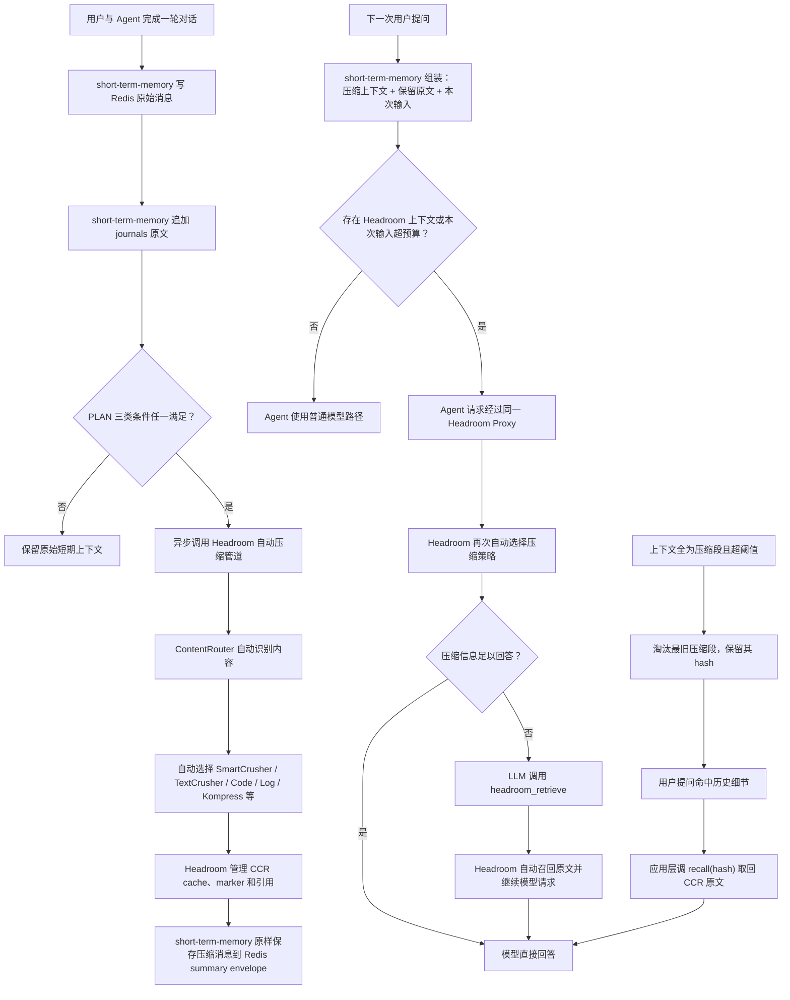

# short-term-memory

`short-term-memory` 是一个面向大模型与 AI Agent 的短期记忆管理模块，现在以独立 HTTP 记忆服务形式运行。

它使用 Redis 保存当前 session 的在线上下文，包括最近消息、summary 和恢复状态；
使用 journals JSONL 作为完整对话事件日志，保存原始会话记录。

当 session 上下文达到 PLAN 定义的触发条件（token 数量、消息数量或 session 时长）时，
short-term-memory 调用官方 Headroom 服务进行上下文优化。压缩策略、CCR 可逆缓存以及后续原文召回均由 Headroom 管理。

Agent 接入层通过 `AgentChatClient` 或 HTTP 接口（write / read / recall）使用记忆服务：
写入对话与附件、读取当前上下文、在模型需要时按 hash 召回被压缩的原文。

| 职责 | 实现 |
|---|---|
| 在线短期上下文 | Redis Session Context |
| 完整经历记录 | journals JSONL |
| 上下文压缩 | 外部 Headroom Service |
| 五类 session 摘要 | 注入的 SummaryModel |
| CCR 原文召回 | Headroom CCR + 应用层 recall |
| 最终回答 | 公司自己的 LLM / Agent |

本项目只覆盖短期记忆，不包含历史会话窗口、Memory Retrieval Skill、用户画像、AI 决策卡、
Wiki、索引或 Daily Memory Job。

## 架构

左侧链路描述一轮对话
结束后的后台预压缩；右侧链路描述下一次用户提问时的上下文读取、模型调用和官方 CCR
按需召回。新增的下方链路是应用层主动召回：当压缩段被淘汰后，通过保留的 hash 从 CCR
缓存取回原文。



`short-term-memory` 负责 Redis、journals、压缩触发、上下文瘦身（保留预算、淘汰最旧段）
和 summary；Headroom 负责内容识别、压缩器选择及其官方 CCR；公司 Agent 负责最终模型请求和回答。

## 依赖与调用方式

| 组件 | 版本/形式 | 作用 | 部署位置 |
|---|---|---|---|
| short-term-memory | Python package `0.1.0` | Redis/journals 编排、HTTP 服务、触发、召回 | 独立 HTTP 服务或进程内 |
| Redis Server | `7.2.15` | 当前 session messages、summary、ccr-summaries | 外部服务 |
| redis-py | `6.4.0` | Redis 连接池、事务和数据命令 | 项目 Python 环境 |
| Headroom | `headroom-ai[all]==0.33.0` | 自动压缩、Proxy、官方 CCR | 独立 HTTP/uv tool 进程 |
| SummaryModel | 注入 | 提取五类 session 摘要 | 模型服务/adapter |
| 最终 LLM/Agent | 公司自研 | 使用短期上下文生成回答 | 公司 Agent 系统 |

### Redis 是怎么调用的

Redis Server 独立部署，`short-term-memory` 不复制或运行 Redis 源码。Python 侧通过
`redis==6.4.0` 调用：

```python
from short_term_memory.storage.redis_runtime import RedisRuntime

redis_runtime = RedisRuntime.connect("redis://127.0.0.1:6379/0")

runtime = build_runtime(
    # 其他公司侧依赖省略
    redis_client=redis_runtime.client,
    ...
)
```

`RedisRuntime.connect()` 使用 `redis.ConnectionPool.from_url()` 创建连接池，构造
`redis.Redis` 客户端并执行 `PING`。该客户端注入 `build_runtime()` 后，由存储层调用：

| 场景 | Redis 调用 |
|---|---|
| 写用户/助手消息 | transaction pipeline：`RPUSH` + `EXPIRE` |
| 读取最近原文 | `LRANGE` |
| 检查 session 是否存在 | `EXISTS` |
| 读取 summary | `GET` |
| 压缩后裁剪原文 | Lua `trim-originals`（保留 token 预算内原文） |
| hash→摘要映射 | `HSET` / `HGETALL`（`ccr-summaries`） |
| 写 summary | transaction pipeline：`SET EX` + `EXPIRE` |
| 删除 session | `DEL` messages key 和 summary key |

正常回答只读取 Redis。只有 Redis session 过期时，组件才根据同一 `user_id + session_id`
从 journals 恢复。

### Headroom 是怎么调用的

Headroom 作为独立 HTTP/Proxy 服务运行，`short-term-memory` 不 `import headroom`，也不包含
Kompress、ONNX、PyTorch 等模型依赖。调用分为三条路径：

1. **回答后的后台压缩**：`CompressionWorker` 向
   `POST {HEADROOM_SERVICE_URL}/v1/compress` 发送保持 message boundary 的历史消息和
   HMAC 去标识化 scope headers。返回的 messages 原样进入 Redis summary envelope。
2. **下一轮真实模型请求**：read 返回
   `headroom.proxy_url={HEADROOM_SERVICE_URL}/v1` 和同一组 `headroom_scope_headers`。公司 Agent
   把实际 OpenAI-compatible 请求发往该 Proxy，Headroom 再转发到上游模型，并在官方
   支持范围内处理压缩与 CCR。
3. **应用层召回**：`POST /v1/memories/recall` 向 `POST {HEADROOM_SERVICE_URL}/v1/retrieve`
   发送 marker hash，取回 CCR 缓存中的原文。沿 hash 链递归解析，始终返回最开始的原文。

```text
公司 Agent 进程
  ├─ AgentChatClient / HTTP ── redis-py ─────────────> Redis Server
  ├─ 后台 CompressionWorker ── /v1/compress ────────> Headroom Service
  ├─ 实际 LLM 请求 ── /v1/chat/completions ─────────> Headroom Proxy ──> 上游模型
  └─ recall(hash) ── /v1/retrieve ──────────────────> Headroom CCR
```

Headroom 自己决定使用 ContentRouter、SmartCrusher、文本/代码/日志压缩器或 Kompress；
本项目只决定何时触发，并通过 `CompressionClient` 保持压缩服务可替换。

## 项目结构

```text
.
├── src/short_term_memory/
│   ├── __init__.py                       # 稳定公开 API（含 AgentChatClient）
│   ├── config.py                         # 环境变量和运行设置
│   ├── models.py                         # PreparedTurn、summary、压缩结果模型
│   ├── ports.py                          # 公司适配器与外部组件 Protocol
│   ├── cli.py                            # short-term-memory-api / worker 入口
│   ├── agent/
│   │   └── agent_chat.py                 # AgentChatClient：完整对话编排 + 自动召回
│   ├── api/
│   │   ├── conversation_handler.py       # 回答前/回答后会话编排（SDK 兼容）
│   │   └── runtime.py                    # build_runtime 与运行时 facade
│   ├── service/
│   │   ├── app.py                        # FastAPI 三个业务接口 + 运维端点
│   │   ├── memory_service.py             # write/read/recall 核心业务
│   │   ├── runtime.py                    # HTTP 服务运行时组装
│   │   ├── schemas.py                    # 请求/响应模型
│   │   ├── auth.py                       # Bearer 认证
│   │   └── metrics.py                    # Prometheus 指标
│   ├── storage/
│   │   ├── async_redis_memory_store.py   # Redis 原子操作 + trim + ccr-summaries
│   │   ├── redis_runtime.py              # redis-py 连接生命周期
│   │   ├── redis_session_context.py      # Redis session、TTL、history、恢复
│   │   ├── journal_store.py              # 按 session 追加/读取 JSONL
│   │   └── vfs_adapter.py                # 用户隔离 journals 目录
│   ├── compression/
│   │   ├── async_headroom_client.py      # 异步 /v1/compress HTTP adapter
│   │   ├── ccr_recall.py                 # CCR 召回客户端 + 递归解析
│   │   ├── recall_policy.py              # 召回判断策略（关键词/语义/模型）
│   │   ├── headroom_client.py            # /v1/compress HTTP adapter
│   │   ├── policy.py                     # PLAN 三类 OR 触发条件
│   │   ├── scope.py                      # HMAC 去标识化 Headroom scope
│   │   ├── summary.py                    # 五类短期摘要生成与校验
│   │   └── telemetry.py                  # 无对话正文的指标状态
│   └── jobs/
│       ├── compression_worker.py         # 压缩 worker + 淘汰最旧段
│       └── redis_compression_queue.py    # 持久压缩队列
├── examples/
│   ├── chat_loop.py                      # 交互式多轮聊天（含 @file）
│   └── deepseek_chat.py                  # DeepSeek 独立调用示例
├── tests/                                # 单元/集成/负载测试
├── compose.redis.yml
├── compose.memory.yml
├── .env.example
└── pyproject.toml
```

## 快速开始

### 1. 获取并安装项目

要求 Python 3.11–3.13、Docker 和 `uv`。

```bash
git clone --branch short-term-memory --single-branch \
  https://github.com/ZCDu/AGFS-MEM.git short-term-memory
cd short-term-memory

python3.13 -m venv .venv
.venv/bin/python -m pip install -e ".[dev,api,deepseek]"
```

也可以安装已经构建的 wheel：

```bash
.venv/bin/python -m pip install dist/short_term_memory-0.1.0-py3-none-any.whl
```

### 2. 启动 Redis

仓库提供 `compose.redis.yml`，使用 `redis:7.2.15-bookworm`：

```bash
docker compose -f compose.redis.yml up -d
docker compose -f compose.redis.yml exec redis redis-cli ping
```

预期返回：

```text
PONG
```

停止服务：

```bash
docker compose -f compose.redis.yml down
```

### 3. 安装并启动 Headroom

Headroom 是独立、可替换的本地进程，不安装进 `short-term-memory` 的 `.venv`。推荐使用
`uv tool` 创建隔离环境：

```bash
uv tool install --python 3.13 "headroom-ai[all]==0.33.0"
headroom --version
```

启动官方 Proxy：

```bash
HEADROOM_CCR_TTL_SECONDS=43200 headroom proxy \
  --host 127.0.0.1 \
  --port 8787 \
  --mode token \
  --openai-api-url https://api.deepseek.com
```

在另一个终端检查：

```bash
curl http://127.0.0.1:8787/health
```

本项目不指定 `--compressor`。ContentRouter 会根据普通文本、JSON/tool output、代码或日志
自动选择 Headroom 当前版本提供的压缩策略；Kompress 只是其中一种。

### 4. 创建配置

```bash
cp .env.example .env
```

本地开发的最小配置：

```dotenv
SHORT_TERM_MEMORY_ENV=development
SHORT_TERM_MEMORY_HOME=~/.dream
SHORT_TERM_MEMORY_SCOPE_SECRET=development-only-scope-secret
REDIS_URL=redis://127.0.0.1:6379/0
HEADROOM_SERVICE_URL=http://127.0.0.1:8787
```

生产环境必须显式设置：

```dotenv
SHORT_TERM_MEMORY_ENV=production
SHORT_TERM_MEMORY_SCOPE_SECRET=replace-with-a-production-secret
HEADROOM_SERVICE_URL=http://127.0.0.1:8787
```

生产环境缺少 Headroom URL 或 scope secret 时，配置加载会直接失败，不会静默降级。

### 5. 启动 HTTP 服务与 worker

```bash
uv run short-term-memory-api      # HTTP 服务，默认 8080
uv run short-term-memory-worker   # 后台压缩 worker
```

验证：

```bash
curl http://127.0.0.1:8080/health   # {"status":"ok"}
```

### 6. 接入公司大模型或 Agent

**方式一：使用 `AgentChatClient`（推荐，公司 Agent 直接复用）**

```python
from short_term_memory import AgentChatClient

client = AgentChatClient(
    memory_api_url="http://127.0.0.1:8080",
    model_call=model_call,   # async fn(messages, model, proxy_url, scope_headers) -> {"content","tool_calls"}
    auth_token="...",
)
answer = await client.turn("user-001", "session-001", "用户的问题")
```

`AgentChatClient` 封装完整编排：写用户消息 → 读上下文 → 调模型 → 处理
`headroom_retrieve` 工具调用（自动召回原文）→ 写回答。公司 Agent 无需复制示例脚本。

**方式二：直接调用 HTTP 接口**（三个业务接口）

```python
import httpx

MEMORY_URL = "http://127.0.0.1:8080"
HEADERS = {"Authorization": "Bearer <token>"}

# 写记忆
httpx.post(f"{MEMORY_URL}/v1/memories/write", headers=HEADERS, json={
    "user_id": "u-001",
    "session_id": "s-001",
    "events": [{"event_id": "evt-001", "role": "user",
                "content_type": "conversation", "content": "用户的问题", "metadata": {}}],
})

# 读记忆
memory = httpx.post(f"{MEMORY_URL}/v1/memories/read", headers=HEADERS, json={
    "user_id": "u-001", "session_id": "s-001",
}).json()

# 调模型（经过 Headroom Proxy）
client = OpenAI(api_key=..., base_url=memory["headroom"]["proxy_url"],
                default_headers=memory["headroom"]["scope_headers"])
resp = client.chat.completions.create(model="deepseek-v4-flash", messages=memory["messages"])

# 若模型返回 headroom_retrieve 工具调用，用 hash 调召回接口
recalled = httpx.post(f"{MEMORY_URL}/v1/memories/recall", headers=HEADERS, json={
    "user_id": "u-001", "session_id": "s-001",
    "hashes": [hash_value],
}).json()
```

## 核心接口

### HTTP 业务接口

项目提供三个业务接口，均需 `Authorization: Bearer <MEMORY_API_AUTH_TOKEN>`：

**1. 存记忆 `POST /v1/memories/write`**

```json
{
  "user_id": "u-001",
  "session_id": "s-001",
  "session_seconds": 30,
  "events": [{"event_id": "evt-001", "role": "user", "content_type": "conversation",
              "content": "继续刚才的问题", "metadata": {}}]
}
```

`event_id` 是幂等键。原文先落 Journal，再提交 Redis；达到阈值时异步排队，不阻塞 write。
`content_type` 支持 `conversation` / `code` / `document` / `skill`。

**2. 读记忆 `POST /v1/memories/read`**

```json
{
  "user_id": "u-001",
  "session_id": "s-001",
  "history_turns": 10,
  "include_effective_config": true
}
```

响应包括 `messages`（语义摘要 + 压缩段 + 保留原文）、`headroom.proxy_url`、
`headroom.scope_headers`、`ccr_markers`（召回标记 hash）、`memory`、`timing_ms`。

**3. 召回原文 `POST /v1/memories/recall`**

```json
{
  "user_id": "u-001",
  "session_id": "s-001",
  "hashes": ["8abe70137f195e528d32a9d8"],
  "query": "用户当前问题（可选）"
}
```

返回每个 hash 对应的原始内容。`query` 提供时按 hash→摘要映射排序，优先召回相关段；
沿 hash 链递归解析，始终返回最开始的原文。

### SDK 接口（兼容层）

### `build_runtime(...)`

组装 Redis Session Context、JournalStore、Headroom HTTP adapter、触发策略、后台任务和
telemetry。所有公司相关实现都通过参数注入。

### `runtime.prepare_turn(...) -> PreparedTurn`

回答前调用，执行 Redis 检查、journals 恢复、读取 summary、写入用户消息，返回
`history`、`headroom_proxy_url` 和去标识化 `headroom_headers`。

### `runtime.complete_turn(...) -> CompletionResult`

回答后调用，写助手消息、检查 PLAN 触发条件、投递后台压缩。

## 上下文管理策略

### 保留最近原文（token 预算）

项目保留模型上下文窗口一定比例（默认 25%）的**最近原文**，这部分永不压缩、read 直接返回；
更早的内容进入压缩段。相比"固定轮数"，按 token 预算保留能自适应上下文大小。

### 普通压缩

当模型可见完整上下文（保留原文 + 压缩段）超过上下文窗口的 60%–70% 时，触发普通压缩：
只压缩**超出保留预算的原文**，保留的最近原文不动。

### 淘汰最旧压缩段

当上下文已全部是压缩段（除保留原文外）且压缩段超过阈值时，删除**最旧的压缩段**，
使上下文真正变小。被淘汰段的 marker hash 保留在 Redis 的 `ccr-summaries` 映射中，
用户之后问到该段时，仍可通过 hash 从 Headroom CCR 缓存召回原文（CCR TTL 内有效）。

## Redis、journals 与 summary

### Redis key

为了保持现有数据兼容，key 前缀继续使用 `dream`：

```text
dream:session:{user_id}:{session_id}:messages
dream:session:{user_id}:{session_id}:summary
dream:session:{user_id}:{session_id}:ccr-summaries
```

- `messages`：Redis List，保存当前 session 最近原文消息（保留预算内）。
- `summary`：Redis String，保存五类语义和 Headroom 压缩上下文 envelope。
- `ccr-summaries`：Redis Hash，保存 marker hash → 内容摘要，供按 query 召回排序。
- 默认 TTL：`43200` 秒，即 12 小时。

Redis 只保存在线短期状态，可以过期；它不是长期事实源。

### journals

完整事件按用户、日期和 session 写入：

```text
{SHORT_TERM_MEMORY_HOME}/{user_id}/journals/{YYYY-MM-DD}-{session_id}.jsonl
```

journals 是完整经历记录。正常回答不读取 journals；只有 Redis session 过期时，组件才按
同一 `session_id` 恢复最近 N 轮。

### Session summary

Headroom 负责降低 token，注入的 SummaryModel 负责生成 PLAN 要求的五类语义：

```text
current_goal
preferences
confirmed_facts
pending_items
attachment_references
```

summary 只写 Redis，不进入 Wiki，也不能代替 journals 原文。

## Headroom 压缩与 CCR

### DREAM 决定何时触发

每轮结束后检查三个 OR 条件：

```text
estimated_tokens >= context_window_tokens * trigger_ratio
OR message_count >= max_messages
OR session_seconds >= max_session_seconds
```

- `trigger_ratio` 必须在 `0.60`–`0.70`，默认 `0.65`。
- 默认消息数阈值为 `100`。
- 默认 session 时长阈值为 `14400` 秒。

### Headroom 决定如何压缩

后台任务调用 `POST {HEADROOM_SERVICE_URL}/v1/compress`，保持 message boundary，不把
整个 session 拼成一个大字符串，也不自行选择 Router、Kompress 或 SmartCrusher。
Headroom 返回的 messages 作为不透明协议对象保存。

### 官方 CCR 边界

后台压缩与实时 Agent 请求使用同一组 `dream-v1` HMAC scope headers。公司 Agent 把真实
模型请求发送到 read 返回的 `headroom.proxy_url` 后，Headroom 才有条件负责 marker、
相关性判断、`headroom_retrieve` 和供应商支持的自动续跑。

**已接通的应用层主动召回：** 由于 Headroom 0.33.0 的透明自动续跑在 OpenAI/DeepSeek
链路上不可靠，项目实现了应用层召回：AgentChatClient 或 HTTP 调用方识别模型返回的
`headroom_retrieve` 工具调用，用 hash 调 `/v1/memories/recall` 取回原文，再继续模型请求。
这使召回可控、可测试、可运维。

### 二次压缩的实测边界

实测确认：Headroom 对已压缩内容不会再次压缩（`tokens_after == tokens_before`）。
因此"上下文全为压缩段且超阈值"时，项目不重复压缩，而是**淘汰最旧压缩段**来真正缩小上下文。
被淘汰段的 hash 保留在 `ccr-summaries`，仍可通过 CCR 召回。

## 配置

| 环境变量 | 默认值 | 说明 | production |
|---|---:|---|---|
| `SHORT_TERM_MEMORY_HOME` | `~/.dream` | journals 数据根目录 | 可选 |
| `SHORT_TERM_MEMORY_ENV` | `development` | `development` / `production` | 必须设为 `production` |
| `SHORT_TERM_MEMORY_SCOPE_SECRET` | 开发默认值 | 生成匿名 Headroom scope | 必填 |
| `REDIS_URL` | `redis://127.0.0.1:6379/0` | Redis 连接 URL | 按部署配置 |
| `REDIS_SESSION_TTL_SECONDS` | `43200` | messages/summary TTL | 可选 |
| `REDIS_HISTORY_TURNS` | `10` | 在线保留最近 N 轮 | 可选 |
| `REDIS_RETAIN_RATIO` | `0.25` | 保留原文占上下文窗口比例 | 可选 |
| `CONTEXT_WINDOW_TOKENS` | `128000` | Agent 模型上下文窗口 | 按模型配置 |
| `HEADROOM_TRIGGER_RATIO` | `0.65` | token 触发比例，范围 0.60–0.70 | 可选 |
| `HEADROOM_MAX_MESSAGES` | `100` | Redis 消息数阈值 | 可选 |
| `HEADROOM_MAX_SESSION_SECONDS` | `14400` | session 时长阈值 | 可选 |
| `HEADROOM_SERVICE_URL` | 空 | Headroom 服务根 URL | 必填 |
| `HEADROOM_SERVICE_TIMEOUT_SECONDS` | `300` | `/v1/compress` 超时 | 可选 |
| `HEADROOM_CCR_TTL_SECONDS` | `43200` | 压缩上下文可附加时长 | 与 Headroom 服务一致 |

进程环境变量优先于 `.env` 文件中的同名值。

## 容错与可观测性

### Development

Headroom 服务不可用、超时或响应非法时：

- 使用原始 messages 作为 fallback，继续调用 SummaryModel。
- `fallback_used=true`。
- 输出不包含完整对话正文的 warning。

### Production

Headroom 调用失败时：

- 不把错误暴露给最终 Agent 用户。
- 不调用 SummaryModel。
- 不写 Redis summary。
- 保留 Redis 和 journals，交给异步 RetryQueue。

默认 `InMemoryHeadroomTelemetry` 提供指标（压缩成功/失败/回退/noop、压缩率、上下文附加、
scope 生成失败）。指标和日志不记录用户消息正文。

## 测试

### 不依赖外部服务

```bash
PYTHONPATH=src .venv/bin/python -m pytest -q
.venv/bin/python -m ruff check src tests examples scripts
```

### 真实 Redis

```bash
SHORT_TERM_MEMORY_RUN_REDIS_INTEGRATION=1 \
REDIS_URL=redis://127.0.0.1:6379/15 \
PYTHONPATH=src .venv/bin/python -m pytest -q -s \
tests/integration/test_redis_session_context.py
```

### 真实 Headroom 自动路由

```bash
SHORT_TERM_MEMORY_RUN_HEADROOM_AUTO_ROUTING=1 \
HEADROOM_SERVICE_URL=http://127.0.0.1:8787 \
PYTHONPATH=src .venv/bin/python -m pytest -q -s \
tests/integration/test_headroom_auto_routing.py
```

### 官方 Proxy/CCR

```bash
SHORT_TERM_MEMORY_RUN_HEADROOM_PROXY_CCR=1 \
SHORT_TERM_MEMORY_HEADROOM_BINARY="$HOME/.local/bin/headroom" \
PYTHONPATH=src .venv/bin/python -m pytest -q -s \
tests/integration/test_headroom_proxy_ccr_flow.py
```

opt-in 测试被跳过不能写成通过；CCR 测试只有在压缩、检索和模型自动续跑全部成功时，
才能证明官方透明召回链路完成。
