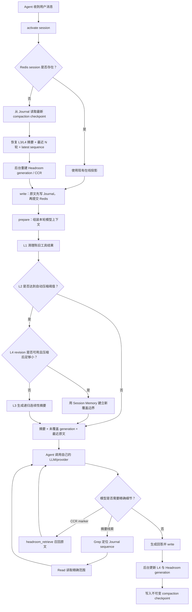
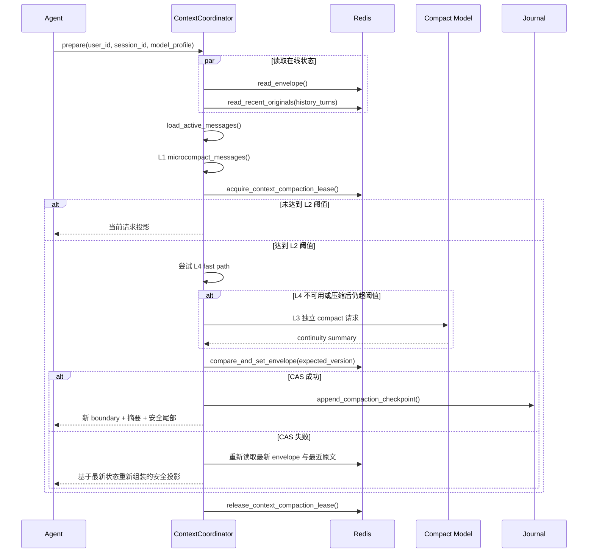
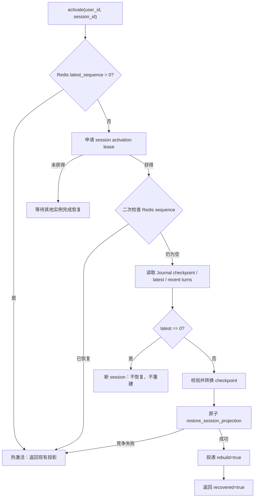
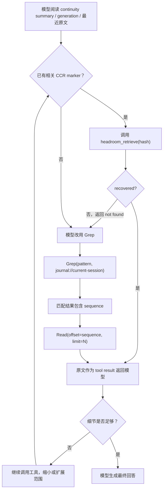

# short-term-memory

`short-term-memory` 是一个面向大模型与 AI Agent 的短期记忆管理模块，以独立 HTTP 服务形式运行。

它使用 Redis 保存当前 session 的在线上下文，包括最近消息、Headroom generation、连续性摘要和压缩状态；使用 Journal JSONL 持久保存完整原始事件，并保存可用于历史 session 恢复的不可变压缩检查点。

每次 Agent 调用模型前，服务会根据当前上下文状态依次执行微压缩、自动压缩判断、Session Memory 快速压缩和传统连续性压缩。较早内容可以被摘要反复覆盖，最近完整对话轮次继续按原文保留，从而让长会话持续运行，而不是让历史内容不断占满模型窗口。

用户切换回历史 session 时，Agent 会在写入新问题前先激活该 session。若 Redis 已过期，服务从 Journal 恢复最新压缩摘要、最近 N 轮原文和历史 sequence，并在后台重建 Headroom generation 与 CCR 召回入口。

| 职责 | 实现 |
|---|---|
| 在线短期上下文 | Redis Session Projection |
| 完整原始记录 | Journal JSONL |
| 请求级微压缩 | L1 Micro Compact |
| 自动压缩调度 | L2 Auto Compact |
| 结构化会话记忆 | L4 Session Memory |
| 递归连续性摘要 | L3 Traditional Compact |
| 细节压缩 | Headroom generation |
| 精确原文召回 | Headroom CCR + Journal Grep/Read |
| 历史 session 恢复 | compaction checkpoint + 最近 N 轮 |
| 最终回答 | Agent 自己的 LLM/provider |

Headroom 只压缩并转发 Agent 当前要发送给模型的上下文，同时提供 generation 和 CCR；它不拥有、也不替换 Redis 中的当前 session 上下文。当前上下文的覆盖边界、摘要版本、最近原文和历史恢复均由 `short-term-memory` 管理。

## 架构

下图描述正常会话、递进压缩、精确召回和历史 session 冷恢复的完整链路。



一次完整的 Agent 调用顺序是：

```text
activate → write(user) → prepare → model/tool loop → write(assistant)
```

- `activate` 必须发生在新消息写入之前，保证历史 sequence 连续。
- `write` 采用 Journal-first，原文持久化后才提交 Redis。
- `prepare` 返回本次真正要发给模型的有界上下文和召回工具。
- 模型根据摘要与 marker 自主决定是否召回细节，用户不需要手动操作。
- assistant 消息写入后，后台任务继续维护 Session Memory 和 Headroom generation。

## 依赖与调用方式

| 组件 | 版本/形式 | 作用 | 部署位置 |
|---|---|---|---|
| short-term-memory | Python package `0.1.0` | 上下文编排、压缩、恢复、HTTP 工具 | 独立 HTTP 服务 |
| Redis Server | 外部服务 | 当前 session、压缩 envelope、队列和租约 | 独立进程/容器 |
| redis-py | `6.4.0` | Redis 连接池、事务和 Lua 原子操作 | 记忆服务进程 |
| Headroom | 独立 HTTP/Proxy 服务 | generation 压缩、Proxy、CCR | 独立进程/容器 |
| ContinuityCompactionModel | 可注入 adapter | L3/L4 独立 compact 请求 | 与 Agent 相同 provider |
| 最终 LLM/Agent | 调用方实现 | 使用准备后的上下文生成回答 | Agent 系统 |

Agent 与 Journal 不需要位于同一台机器或同一容器。Agent 只通过 HTTP 调用记忆服务，并通过受 session scope 约束的 `journal://current-session` 工具访问当前 session 的逻辑 transcript。

### Redis 是怎么调用的

Redis Server 独立部署。服务通过异步 redis-py 客户端和 Lua 脚本保证 sequence、幂等写、envelope CAS、历史恢复与租约操作的原子性。

| 场景 | Redis 操作 |
|---|---|
| 为事件分配 sequence | Lua reserve-event |
| 提交用户/助手消息 | Lua commit-event |
| 读取最近原文 | `LRANGE` |
| 读取压缩 envelope | `GET` |
| 并发更新压缩状态 | version CAS Lua |
| 裁剪已覆盖原文 | trim-originals Lua，保留最近 token 预算 |
| 历史 session 冷恢复 | restore-session-projection Lua |
| CCR hash→摘要索引 | `HSET` / `HGETALL` |
| 压缩与激活互斥 | Redis lease |

Redis 是在线投影，可以按 TTL 过期；Journal 才是可重建的持久事实源。

### Headroom 是怎么调用的

Headroom 作为独立 HTTP/Proxy 服务运行，调用分为三条路径：

1. **后台 generation 压缩**：worker 向 `/v1/compress` 发送离开最近原文保护区的原始消息。返回结果作为不透明 `CompressionGeneration` 写入 Redis envelope。
2. **真实模型请求**：`prepare` 返回 Proxy URL 和去标识化 scope headers，Agent 将实际模型请求发往该 Proxy。
3. **CCR 原文召回**：模型产生 `headroom_retrieve` 工具调用后，Agent 按 marker hash 调用 `/v1/memories/recall`，再把原文工具结果交回同一个模型。

Headroom 输入只包含原文，不包含 L3/L4 摘要或旧 generation。已被活动摘要覆盖的 generation 不再进入 prompt，但其 marker 在有效期内仍可用于 CCR 召回。

### ContinuityCompactionModel 是怎么调用的

`ContinuityCompactionModel` 由部署层注入，使用与 Agent 相同的 LLM/provider，但发起独立、单轮、无工具的 compact 请求：

- L4 在后台更新结构化 Session Memory，不阻塞正常模型请求。
- L3 仅在 `prepare` 达到压缩阈值且 L4 无法把上下文降到安全范围时执行。
- compact 请求有独立超时和模型名配置，不复用当前回答请求。
- 只有输出校验成功且 Redis envelope CAS 成功后，才推进覆盖 sequence。

## 项目结构

```text
.
├── src/short_term_memory/
│   ├── __init__.py
│   ├── cli.py                              # API / worker 进程入口
│   ├── config.py                           # 环境变量与运行设置
│   ├── models.py                           # 事件、generation、revision、boundary
│   ├── ports.py                            # 外部依赖 Protocol
│   ├── agent/
│   │   └── agent_chat.py                   # activate/write/prepare/tool loop 编排
│   ├── compression/
│   │   ├── micro_compact.py                # L1 请求级微压缩
│   │   ├── auto_compact.py                 # L2 阈值、buffer 与断路器
│   │   ├── session_memory.py               # L4 Session Memory 更新
│   │   ├── session_memory_state.py         # L4 更新条件与状态
│   │   ├── session_memory_compact.py       # L4 快速压缩与安全保尾
│   │   ├── traditional_compact.py          # L3 递归连续性压缩
│   │   ├── compact_prompt.py               # 连续性摘要格式
│   │   ├── context_query.py                # 摘要替换与活动上下文组装
│   │   ├── continuity_model.py             # 可注入 compact model adapter
│   │   ├── generations.py                  # Headroom generation 选择与覆盖
│   │   ├── async_headroom_client.py        # Headroom HTTP adapter
│   │   └── ccr_recall.py                   # CCR marker 原文召回
│   ├── service/
│   │   ├── app.py                          # FastAPI 路由
│   │   ├── memory_service.py               # write/read/recall/transcript 业务
│   │   ├── context_coordinator.py          # prepare 的 L1→L2→L4/L3 编排
│   │   ├── session_activation.py           # 历史 session 有界恢复
│   │   ├── runtime.py                      # 服务依赖组装
│   │   └── schemas.py                      # HTTP 请求/响应模型
│   ├── storage/
│   │   ├── async_redis_memory_store.py     # Redis 原子操作与 CAS
│   │   ├── compaction_checkpoint.py        # 不可变 L3/L4 检查点
│   │   ├── journal_store.py                # Journal 追加与恢复查询
│   │   ├── recent_originals.py             # 最近完整轮次选择
│   │   └── vfs_adapter.py                  # 用户隔离目录
│   ├── transcript/
│   │   ├── journal_transcript.py           # 跨日期逻辑 transcript
│   │   ├── grep_tool.py                    # session 内正则定位
│   │   ├── read_tool.py                    # sequence 精确读取
│   │   └── tool_definitions.py             # 模型工具定义
│   └── jobs/
│       ├── compression_worker.py           # generation 压缩与冷重建
│       ├── redis_compression_queue.py      # 持久压缩队列
│       ├── session_memory_worker.py        # L4 后台 worker
│       └── session_memory_queue.py         # L4 持久队列
├── examples/
├── tests/
├── compose.redis.yml
├── compose.memory.yml
├── .env.example
└── pyproject.toml
```

## 快速开始

### 1. 获取并安装项目

要求 Python 3.11–3.13、Redis、Headroom 和 `uv`。

```bash
git clone --branch short-term-memory --single-branch \
  https://github.com/ZCDu/AGFS-MEM.git short-term-memory
cd short-term-memory
uv sync --extra api --extra deepseek --extra dev
```

### 2. 启动 Redis

```bash
docker compose -f compose.redis.yml up -d
docker compose -f compose.redis.yml exec redis redis-cli ping
```

预期返回 `PONG`。

### 3. 启动 Headroom

Headroom 使用独立环境运行，不安装进本项目 Python 环境。启动服务后，将根 URL 写入 `HEADROOM_SERVICE_URL`。后台 generation 压缩、真实模型 Proxy 和 CCR 必须使用同一 session scope。

### 4. 创建配置

```bash
cp .env.example .env
```

最小开发配置：

```dotenv
SHORT_TERM_MEMORY_ENV=development
SHORT_TERM_MEMORY_HOME=~/.dream
SHORT_TERM_MEMORY_SCOPE_SECRET=development-only-scope-secret
REDIS_URL=redis://127.0.0.1:6379/0
HEADROOM_SERVICE_URL=http://127.0.0.1:8787
CONTINUITY_COMPACTION_ENABLED=true
CONTINUITY_COMPACTION_MODEL=deepseek-v4-flash
```

生产环境必须显式配置 `SHORT_TERM_MEMORY_SCOPE_SECRET`、`HEADROOM_SERVICE_URL` 和 API 认证信息。

### 5. 启动 HTTP 服务与 worker

```bash
uv run short-term-memory-api
uv run short-term-memory-worker
```

```bash
curl http://127.0.0.1:8080/health
curl http://127.0.0.1:8080/ready
```

### 6. 接入 Agent

推荐使用 `AgentChatClient`：

```python
from short_term_memory import AgentChatClient

client = AgentChatClient(
    memory_api_url="http://127.0.0.1:8080",
    model_call=model_call,
    auth_token="...",
    context_window_tokens=128_000,
    max_output_tokens=8_192,
)

answer = await client.turn(
    "user-001",
    "session-001",
    "继续之前的任务",
    history_turns=10,
)
```

`AgentChatClient.turn()` 自动完成：

```text
激活 session
  → 写入用户消息
  → 准备有界上下文
  → 调用模型
  → 执行 headroom_retrieve / Grep / Read
  → 将工具结果交回模型
  → 写入最终回答
```

`model_call` 是可注入的异步 provider adapter。Agent 仍然负责真正的模型调用，记忆服务不生成最终回答。

## 核心接口

所有业务接口在 production 均需 `Authorization: Bearer <MEMORY_API_AUTH_TOKEN>`。

| 方法 | 路径 | 作用 |
|---|---|---|
| POST | `/v1/memories/activate` | 写入前激活当前或历史 session |
| POST | `/v1/memories/write` | 幂等写入原始事件并调度后台任务 |
| POST | `/v1/memories/read` | 读取在线上下文或历史压缩视图 |
| POST | `/v1/memories/prepare` | 执行请求级压缩并返回模型上下文与工具 |
| POST | `/v1/memories/recall` | 按 CCR marker hash 召回原文 |
| POST | `/v1/memories/transcript/grep` | 在当前 session Journal 中定位原文 |
| POST | `/v1/memories/transcript/read` | 按 sequence 范围读取精确原文 |
| GET | `/health` | 进程存活检查 |
| GET | `/ready` | Redis、Journal、Headroom 就绪检查 |
| GET | `/metrics` | Prometheus 指标 |

### 激活 session：`POST /v1/memories/activate`

```json
{
  "user_id": "u-001",
  "session_id": "s-old",
  "history_turns": 10
}
```

```json
{
  "request_id": "req-xxx",
  "recovered": true,
  "latest_sequence": 180,
  "checkpoint_id": "sha256:...",
  "rebuild_queued": true
}
```

该接口必须在任何新写入之前调用。热 session 走幂等快速路径；Redis 已过期时执行有界恢复。`latest_sequence` 保证下一条消息从正确 sequence 继续，`rebuild_queued=true` 表示 Headroom 冷重建已经进入后台队列。

### 写记忆：`POST /v1/memories/write`

```json
{
  "user_id": "u-001",
  "session_id": "s-001",
  "session_seconds": 120,
  "events": [
    {
      "event_id": "evt-001",
      "role": "user",
      "content_type": "conversation",
      "content": "继续刚才的问题",
      "metadata": {}
    }
  ]
}
```

`event_id` 是幂等键。事件先追加到 Journal，再提交 Redis；达到 generation 或 Session Memory 更新条件时只投递后台任务，不阻塞写入。

### 读取上下文：`POST /v1/memories/read`

```json
{
  "user_id": "u-001",
  "session_id": "s-001",
  "history_turns": 10,
  "include_effective_config": true,
  "history": false
}
```

响应包含 `messages`、Headroom Proxy 信息、`ccr_markers`、压缩覆盖 sequence、数据来源和非敏感有效配置。`history=true` 只返回有界历史视图，不把完整 Journal 注入上下文。

### 准备模型上下文：`POST /v1/memories/prepare`

```json
{
  "user_id": "u-001",
  "session_id": "s-001",
  "history_turns": 10,
  "query_source": "main",
  "model_profile": {
    "context_window_tokens": 128000,
    "max_output_tokens": 8192
  }
}
```

`prepare` 按 L1 → L2 → L4/L3 顺序处理，并返回本次调用需要的 `messages`、`tools`、Headroom Proxy 信息、是否发生压缩以及新的 boundary。

### 召回原文：`POST /v1/memories/recall`

```json
{
  "user_id": "u-001",
  "session_id": "s-001",
  "hashes": ["8abe70137f195e528d32a9d8"],
  "query": "此前具体的错误信息"
}
```

服务按 marker hash 从 CCR 读取原文。`query` 可用于给多个候选 marker 排序。CCR 不可用或摘要中没有 marker 时，Agent 继续使用 Journal Grep/Read。

## 上下文管理策略

上下文压缩由多个职责清晰、逐步升级的层次共同完成。它们都只改变模型可见的活动投影，不删除 Journal 原文。

这一章需要区分三个概念：

- **持久原文**：Journal 中按 sequence 追加的原始事件，是最终事实源。
- **在线压缩状态**：Redis `MemorySummaryEnvelope` 中的 generation、Session Memory、active revision 和压缩跟踪状态。
- **本次请求投影**：`prepare` 返回给 Agent 的 messages。L1 只改这一层；L3/L4 成功后会创建新的持久 active revision。

### 源码导航

| 源码 | 关键入口 | 职责 |
|---|---|---|
| `service/context_coordinator.py` | `ContextCoordinator.prepare()` | 一次请求的 L1→L2→L4/L3 总编排、lease、CAS、checkpoint |
| `compression/context_query.py` | `load_active_messages()` | 从 envelope 和最近原文组装唯一活动上下文 |
| `compression/micro_compact.py` | `microcompact_messages()` | L1 时间触发的工具结果清理 |
| `compression/auto_compact.py` | `auto_compact_if_needed()` | L2 token 阈值、L4→L3 分派和失败断路器 |
| `compression/session_memory_state.py` | `should_extract_memory()` | 判断何时后台更新 Session Memory |
| `compression/session_memory.py` | Session Memory extraction/update | 调用 compact model、校验结构、推进 L4 coverage |
| `compression/session_memory_compact.py` | `try_session_memory_compaction()` | 使用现成 L4 revision 快速建立 boundary |
| `compression/traditional_compact.py` | `compact_conversation()` | L3 连续性摘要、PTL 重试和 boundary 生成 |
| `compression/generations.py` | generation 选择函数 | 选择 original-only Headroom 输入并维护代次 |
| `jobs/compression_worker.py` | compression worker | 后台生成、淘汰和冷重建 Headroom generation |
| `models.py` | `MemorySummaryEnvelope` 等 | 定义 generation、revision、boundary 和 tracking |

### 活动上下文是怎么组装的

`ContextCoordinator.prepare()` 先并行读取 Redis envelope 和最近完整轮次，然后调用
`load_active_messages()`。组装顺序固定为：

```text
1. compact boundary system message
2. 当前 active revision 的 continuity summary
3. 尚未被 boundary 覆盖、且 CCR 未过期的 Headroom generations
4. active revision 中明确保留的 messages_to_keep
5. 最近原文中 sequence 大于 boundary.covered_through_sequence 的事件
6. 按 sequence、role 和完整消息内容去重
```

如果没有 `active_revision`，第 1、2、4 项不存在，所有未过期 generation 与最近原文直接组成活动上下文。如果已有 revision，`generation_is_visible()` 只允许
`generation.through_sequence > boundary.covered_through_sequence` 的 generation 进入 prompt；更早 generation 不再占用模型窗口。

`apply_compaction_result()` 使用替换语义：压缩成功后直接返回
`boundary_marker + summary_messages + messages_to_keep + attachments + hook_results`，不会把新摘要追加在此前活动上下文后面。

### 一次 `prepare` 的完整执行顺序



lease 保证同一 session 的昂贵 compact 请求不会并发执行；envelope version CAS 防止压缩期间发生的 generation、Session Memory 或新 revision 更新被迟到结果覆盖。

### L1：Micro Compact

L1 是可选的请求级微压缩。主请求距离上一条 assistant 消息超过配置时间后，服务会清理较旧的 Read、Grep、Bash、Web、Edit 等工具结果，只保留占位说明和最近若干工具结果。

- 只修改本次 `prepare` 返回的 messages。
- 不写回 Redis 或 Journal。
- 不进入 Headroom generation。
- 至少保留最近一个工具结果。

具体触发条件全部满足时才执行：

1. `TIME_BASED_MICROCOMPACT_ENABLED=true`；
2. `query_source` 存在且以 `main` 开头，`compact` 和 `session_memory` 内部请求不会递归触发；
3. 能找到带时区时间戳的最后一条 assistant 消息；
4. 当前时间与该消息的间隔不小于 `TIME_BASED_MICROCOMPACT_GAP_MINUTES`。

可清理工具集合在 `COMPACTABLE_TOOLS` 中固定为 `Read`、`Bash`、`PowerShell`、`Grep`、`Glob`、`WebSearch`、`WebFetch`、`Edit` 和 `Write`。实现先从 assistant 消息收集这些工具的 `tool_use.id`，再只替换 user 消息中对应的 `tool_result.content`，不会破坏 tool-use/tool-result 配对。

`TIME_BASED_MICROCOMPACT_KEEP_RECENT` 即使配置为 0，运行时也通过 `max(1, keep_recent)` 保证至少保留最近一个可压缩工具结果。函数只有在确实节省 token 时才返回新消息元组，否则复用原 messages。

### L2：Auto Compact

L2 根据模型上下文窗口、最大输出 token 和安全 buffer 判断是否必须压缩。达到阈值时先尝试 L4，再根据真实压缩后 token 决定是否继续执行 L3。

- 自动判断使用本次请求的模型 profile，而不是固定假设。
- 同一条压缩链连续失败达到阈值后开启断路器，避免每次请求重复慢调用。
- 压缩成功后清零失败状态。

源码中的阈值计算为：

```text
effective_context_window
  = context_window_tokens - min(max_output_tokens, 20_000)

auto_compact_threshold
  = effective_context_window - 13_000

manual_compact_threshold
  = effective_context_window - 3_000
```

以 128,000 context window、8,192 max output 为例：

```text
effective_context_window = 119,808
auto_compact_threshold   = 106,808
```

L2 使用 `TokenEstimator` 对 provider messages 重新估算，不使用 Redis 中的旧 token 统计。当前 token 低于阈值时直接返回；达到阈值后先调用 `try_session_memory`。只有 L4 返回结果且
`true_post_compact_token_count < threshold` 才接受，否则继续 L3。

`query_source` 为 `compact` 或 `session_memory` 时禁止自动压缩，防止 compact 请求再次触发 compact。`AutoCompactTrackingState.consecutive_failures` 达到 3 后，自动路径直接跳过；L3 成功会通过新的 compaction id 清零失败计数。

### L4：Session Memory

L4 在后台持续维护结构化会话记忆，记录当前任务、关键决策、已有进展、重要上下文和待处理事项。它在正常对话完成后异步更新，不阻塞 Agent 回答。

L2 需要压缩时，如果已有可用的 L4 revision，就直接用它建立新的活动上下文 boundary，并按完整对话轮次保留安全尾部。若实际 token 仍然过高，再进入 L3。

Session Memory 的后台更新条件定义在 `SessionMemoryConfig`：

| 条件 | 默认值 |
|---|---:|
| 首次初始化最小上下文 | 10,000 tokens |
| 两次更新间最小增长 | 5,000 tokens |
| 两次更新间工具调用数 | 3 |
| 等待正在进行的 extraction | 15 秒 |
| extraction 过期判定 | 60 秒 |
| 单章节最大长度 | 2,000 tokens |
| Session Memory 总长度 | 12,000 tokens |

`should_extract_memory()` 要求达到 token 增长条件；如果最后一个 assistant turn 没有工具调用，可直接更新，否则还要达到工具调用数阈值。更新任务通过独立 Redis 队列串行执行，只有 compact model 输出通过完整结构和长度校验后，才生成新的 `SessionMemoryRevision` 并推进 `covered_through_sequence`。

L4 fast path 的接受条件更严格：

1. Session Memory 非空；
2. 能在活动 messages 中找到与 `covered_through_sequence` 精确对应的消息；
3. 能按完整对话轮次选出安全尾部；
4. 移除已有 boundary 后的 `messages_to_keep` 仍保持有效工具轮次；
5. `boundary + Session Memory summary + messages_to_keep` 的真实 token 数低于 L2 阈值。

如果 extraction 正在进行且未超过 60 秒，L4 最多等待 15 秒；超时、过期、coverage 找不到、Session Memory 为空或压缩后仍过大，均返回 `None` 交给 L3，不修改现有状态。

### L3：Traditional Compact

L3 生成结构化连续性摘要，用摘要替换更早的活动上下文，同时保留最近完整消息。下一次压缩会把上一版摘要和新消息一起纳入，因此摘要可以持续递归更新：

```text
原始上下文 A + B
  → 摘要 AB + 最近尾部

摘要 AB + 新消息 C + D
  → 摘要 ABCD + 最近尾部

摘要 ABCD + 新消息 E
  → 摘要 ABCDE + 最近尾部
```

新 revision 采用替换语义，不在 prompt 中叠加此前 revision。覆盖 boundary 之前的 generation 和原文退出活动上下文，但仍可通过 CCR 或 Journal 找回。

L3 通过 `ContinuityCompactionModel.compact()` 发起独立、单轮、无工具请求。模型名来自
`CONTINUITY_COMPACTION_MODEL`，最大输出限制为 20,000 tokens，`query_source="compact"` 用于阻止递归压缩。

如果 provider 返回 `PromptTooLongError`，实现最多重试 3 次：

- 按 assistant 响应边界将 messages 分成完整 API rounds；
- provider 给出 `token_gap` 时，从最旧 round 开始删除，直到累计 token 达到缺口；
- 没有 `token_gap` 时，每次删除最旧的 20% rounds，且至少删除一组；
- 裁剪后移除失去对应 `tool_use` 的孤立 `tool_result`；
- 如果剩余上下文以 assistant 开头，插入元消息说明更早对话已为压缩重试而裁剪。

成功结果会计算两种 token：compact 模型调用消耗，以及最终
`boundary + summary + messages_to_keep` 的 `true_post_compact_token_count`。新 `CompactBoundary` 记录 strategy、trigger、covered sequence、压缩前后 token 和创建时间，供后续可见性判断与诊断。

### Headroom generation

离开最近原文保护区的消息由后台 worker 生成 Headroom generation。generation 保存细节压缩结果及 marker，是 L3/L4 摘要之外的可召回压缩资产。

- 输入严格为原始消息。
- 未被当前 boundary 覆盖的 generation 可以进入活动 prompt。
- 已覆盖 generation 不再占用 prompt，但可暂存在 Redis 供 CCR 使用。
- generation 数量超过上限时淘汰最旧段，同时保留可用的 marker 索引。
- Redis 冷恢复后以 `rebuild=true` 重建当前 session 的 generation 和 CCR scope。

Headroom generation 与 L3/L4 是并行但有边界关联的两套压缩资产：

- generation coverage 由 `compressed_through_sequence` 表示；
- L4 coverage 由 `session_memory.covered_through_sequence` 表示；
- 当前模型上下文 coverage 由 `active_revision.boundary.covered_through_sequence` 表示。

generation worker 只能推进 generation 字段，不能覆盖 active revision 或 Session Memory。反过来，L3/L4 建立新 boundary 时会记录被覆盖的 generation id，并在活动投影中隐藏这些 generation，但不会把它们当成摘要输入再次压缩。

### 保留最近原文

服务同时使用最近 N 轮和 token 预算保护尾部消息：

- 最近完整用户轮次用于保证语义与 tool round 不被从中切断。
- `REDIS_RETAIN_RATIO` 控制原文尾部可占模型窗口的比例。
- 新于压缩 boundary 的消息始终保留。
- 摘要、未覆盖 generation 和最近原文共同组成下一次模型输入。

### 当前摘要设计

当前摘要只承担会话连续性，不代替原文：

- **Session Memory**：后台维护结构化会话状态，供自动压缩快速建立新 boundary。
- **Continuity Summary**：上下文接近窗口上限时生成递归连续性摘要，覆盖早期活动内容。
- **Compaction Checkpoint**：持久保存最新 L3/L4 revision、覆盖 sequence、envelope 版本和生成版本，用于历史 session 恢复。

准确代码、错误信息、工具结果和原始措辞不要求摘要完整复述，而是交给 CCR 或 Journal 精确召回。

### Redis 状态提交、并发与失败边界

压缩状态不是直接覆盖 Redis，而是通过 `expected_version` 提交：

1. `prepare` 记住读到的 envelope version；
2. L3/L4 完成后构造 `version + 1` 的 envelope；
3. `compare_and_set_envelope()` 仅在当前版本仍等于 expected version 时写入；
4. CAS 失败说明期间已有其他 worker 更新状态，当前结果不落库；
5. coordinator 重新读取最新状态，重新执行活动上下文组装和 L1，然后返回安全投影。

CAS 成功且产生新 compaction result 后，才把对应状态转为 `compaction_checkpoint` 追加到 Journal。无 compaction result、仅更新失败计数时不会伪造新的摘要 checkpoint。

最终 `_prepared()` 会再次估算 messages。如果上下文仍超过 `effective_context_window`，且本次没有成功压缩，会抛出 `ContextCompactionUnavailableError`，而不是把必然超窗的请求交给 Agent 模型。

| 失败点 | 状态处理 | 本轮行为 |
|---|---|---|
| L1 条件不满足或未节省 token | 不写任何状态 | 使用原投影继续 |
| L4 不可用 | 不推进 L4 coverage | 自动进入 L3 |
| L3 调用失败 | `consecutive_failures + 1` | 保留此前 revision |
| 获取 compaction lease 失败 | 不执行新的 compact | 使用当前投影；超窗则明确失败 |
| envelope CAS 失败 | 丢弃迟到结果 | reload 后返回最新安全投影 |
| checkpoint 追加失败 | Redis revision 已提交 | 错误向上暴露，后续热激活可补写 checkpoint |

### 递进压缩示例

假设最近尾部保护区保留最后两个完整用户轮次：

```text
阶段 1
Journal: A + B
Redis active: generation(A) + 原文 B
L3/L4 compact: summary(AB) + 尾部 B
boundary.covered_through_sequence = sequence(B 之前的安全覆盖点)

阶段 2
Journal: A + B + C + D
Redis active: summary(AB) + 新 generation(C) + 原文 D
L3/L4 compact: summary(ABCD) + 尾部 C/D

阶段 3
Journal: A + B + C + D + E
Redis active: summary(ABCD) + 原文 E
L3/L4 compact: summary(ABCDE) + 最近尾部
```

每个阶段只保留一个 active revision；Journal 中 A–E 始终不变。摘要负责连续性，generation 和 Journal 负责需要时恢复精确细节。

## 历史 session 切换

历史 session 切换的目标不是把完整历史重新塞回模型，而是在新问题写入前恢复一份足以继续对话、且大小受控的活动上下文。

### 源码导航

| 源码 | 关键入口 | 职责 |
|---|---|---|
| `agent/agent_chat.py` | `AgentChatClient.turn()` | 强制执行 `activate → write → prepare` |
| `service/app.py` | `POST /v1/memories/activate` | HTTP 激活入口和响应契约 |
| `service/session_activation.py` | `SessionActivator.activate()` | 热/冷/新 session 分支、lease 和重建任务 |
| `storage/compaction_checkpoint.py` | `checkpoint_from_envelope()` / `checkpoint_to_envelope()` | 在线压缩状态与持久 checkpoint 互转 |
| `storage/journal_store.py` | `read_latest_compaction_checkpoint()` | 跨日期读取最新 checkpoint 和原文 |
| `storage/recent_originals.py` | `select_recent_turns()` | 保留完整用户轮次，不截断工具回合 |
| `storage/async_redis_memory_store.py` | `restore_session_projection()` | 原子恢复 sequence、messages 和 envelope |
| `jobs/compression_worker.py` | `rebuild=True` job | 冷恢复后重建 generation 与 CCR |

### Agent 为什么必须先激活再写入

Redis 的 sequence key 也会随 session TTL 过期。如果 Agent 直接向历史 session 写入新问题，Redis 可能从 sequence 1 重新分配编号，与 Journal 中已有 sequence 冲突。因此 `AgentChatClient.turn()` 将顺序固定为：

```text
POST /v1/memories/activate
  → POST /v1/memories/write（用户新问题）
  → POST /v1/memories/prepare
  → model/tool loop
  → POST /v1/memories/write（assistant 回答）
```

`activate` 先恢复 `latest_sequence`，后续 reserve-event 才会从历史最大 sequence 的下一位继续。接入方如果不使用 `AgentChatClient`，也必须自己遵守这个顺序。

### 三条激活分支



热 session、冷 session 和从未存在过的新 session 使用同一个接口，但返回值含义不同：

| 场景 | `recovered` | `latest_sequence` | `checkpoint_id` | `rebuild_queued` |
|---|---:|---:|---|---:|
| Redis 在线 | `false` | Redis 当前最大值 | 当前 checkpoint，可为空 | `false` |
| Journal 有历史且冷恢复成功 | `true` | Journal 原文最大值 | 采用的 checkpoint，可为空 | `true` |
| Journal 没有原文 | `false` | `0` | `null` | `false` |

### Redis 未过期

`activate` 检测到 session 在线投影仍存在时直接返回：

- 不重复恢复原文。
- 不重置 sequence。
- 必要时补写最新 compaction checkpoint。
- 不重复投递冷重建任务。

热路径仍会检查 Redis envelope 中是否存在 `active_revision` 或 `session_memory`。如果存在，
`_warm_result()` 会从当前 envelope 计算期望 checkpoint，并与 Journal 最新 checkpoint 比较。缺失或 hash 不一致时补写一次幂等 checkpoint，使“Redis 已成功提交、此前 Journal checkpoint 写入失败”的状态能够自愈。

### Redis 已过期

服务按 `user_id + session_id` 从 Journal 读取：

1. 最新不可变 `compaction_checkpoint`；
2. 最近 N 个完整用户轮次；
3. Journal 中的历史最大 original sequence。

这三项通过线程桥接从同步 JournalStore 读取，避免文件 IO 阻塞异步 HTTP 事件循环：

- `read_latest_compaction_checkpoint()` 跨 session 的所有日期文件扫描 checkpoint，以
  `(envelope_version, created_at)` 选择最强版本；
- `latest_original_sequence()` 只统计 `message` 事件，忽略 checkpoint 和 file 记录；
- `read_recent_originals()` 以固定 8 KiB buffer 反向读取跨日期文件，再交给
  `select_recent_turns()` 排序、去重并保留最近完整用户轮次。

“最近 N 轮”不是简单取最后 N 条消息。一个 turn 从 user 消息开始，后续 assistant/tool 属于该 turn；连续的 user conversation/code/document/skill 输入在收到响应前仍属于同一轮。首个 user 之前的 system 原文作为前缀保留，因此恢复不会从 tool result 或 assistant 半轮开始。

随后通过单个 Redis 原子操作恢复 session projection：

```text
最新 L3/L4 摘要
  + 最近 N 轮原文
  + latest_sequence
  → 有界 Redis 在线上下文
```

恢复不会把完整 Journal 注入 Redis，也不会在同步路径等待新的摘要请求。这样用户切回长历史会话后，第一条新问题即可获得摘要和近期上下文，同时不会被全部历史占满窗口。

### checkpoint 如何恢复为在线 envelope

`checkpoint_to_envelope()` 恢复以下字段：

```text
version                    ← checkpoint.envelope_version
compressed_through_sequence← checkpoint.compressed_through_sequence
session_memory             ← checkpoint.session_memory
active_revision            ← checkpoint.active_revision
auto_compact_tracking      ← checkpoint.auto_compact_tracking
compression_generations    ← ()
```

generation 正文和 marker 不写进 checkpoint，因此冷恢复时明确置空，避免把已过 CCR TTL 的 marker 当成可用上下文。

如果 checkpoint 有 Session Memory、但没有 active revision，`materialize_session_memory_recovery_revision()` 会在本地创建恢复 revision，不调用模型：它用 Session Memory 内容生成 continuity message，以 L4 coverage 创建 `strategy="session_memory"` 的 reactive boundary，并把 coverage 之后的最近原文放入 `messages_to_keep`。

如果 checkpoint 的 `compressed_through_sequence` 大于 Journal 当前最大 original sequence，激活逻辑将其视为不安全并放弃 checkpoint，只恢复最近原文和 sequence。

### Redis 原子恢复

`restore_session_projection()` 通过 Lua 一次性检查并写入：

1. sequence key 不存在；
2. messages list 为空；
3. summary envelope 不存在；
4. 没有 pending reservation；
5. 为最近原文重建 event digest、committed 状态和原 sequence；
6. 写入历史最大 sequence；
7. checkpoint 可用时写入恢复后的 envelope；
8. 为在线 key 设置统一 TTL。

任何前置条件不满足都返回 `not_restored`，不进行部分写入。调用方随后走 `_warm_result()` 读取竞争者已经恢复的投影，避免两个 API 实例互相覆盖。

### compaction checkpoint

每次 L3/L4 连续性状态更新后，服务将最新状态写成不可变 Journal 记录。checkpoint 包括：

- L4 Session Memory revision；
- 当前 L3/L4 active revision；
- 各自覆盖到的 sequence；
- envelope version 与 generation versions；
- auto-compact tracking；
- 内容哈希生成的 checkpoint id。

checkpoint 不保存 Headroom generation 正文或 CCR 原文。它负责恢复连续性状态；Headroom 细节压缩资产由后台冷重建恢复。

`checkpoint_id` 不是随机 ID。`checkpoint_from_envelope()` 将 scope、版本、coverage、generation 版本号、L3/L4 revision、tracking 和创建时间序列化为排序后的 canonical JSON，再计算 SHA-256。相同状态会得到相同 id，`append_compaction_checkpoint()` 因而能够在进程锁和文件锁保护下幂等追加。

checkpoint 是不可变记录，不原地修改旧行。恢复时选择最新 envelope version，使旧 checkpoint 可用于审计，同时保证在线投影使用最新压缩状态。

### 后台 Headroom 冷重建

冷恢复提交 Redis 后立即投递 `rebuild=true` 的 generation 任务，但不阻塞用户请求。worker 从同一 session 的原始事件重建 Headroom generation、marker 和 CCR scope。

若重建期间有新消息或 L3/L4 更新导致 envelope version 变化，worker 会基于最新 envelope 重新合并结果，避免旧任务覆盖新的 boundary 或摘要。

重建 job id 由 `user_id + session_id + expected_version + latest_sequence + rebuild` 生成稳定 UUID，因此重复激活不会制造语义相同的不同任务。job 携带：

- `expected_version`：恢复后 envelope 的版本，没有 checkpoint 时为 0；
- `requested_through_sequence`：Journal 历史最大 sequence；
- `rebuild=True`：要求从 session 原文重建 generation，而不是只压缩新尾部。

同步激活只保证“摘要 + 最近 N 轮”立即可用，不等待 Headroom。CCR/generation 在 worker 完成后恢复；worker 提交时必须重新读取并合并最新 envelope，不能把激活后新写入的消息、更新后的 Session Memory 或新的 active boundary 回退掉。

### 激活并发、超时与失败处理

`SessionActivator` 使用独立 activation lease，而不是 context compaction lease：两类任务职责不同，可以分别观测。未获得 lease 的实例每 100 ms 检查一次 Redis sequence，直到其他实例恢复成功；超过 `activation_timeout_seconds` 抛出 `SessionActivationUnavailableError`。

| 情况 | 处理 |
|---|---|
| 多实例同时切换同一历史 session | 一个实例恢复，其余等待在线投影 |
| lease 获得后发现已有 sequence | 直接转热路径 |
| Journal 没有原文 | 作为新 session 返回，不创建空 checkpoint |
| checkpoint coverage 超出 Journal | 丢弃 checkpoint，保留原文恢复能力 |
| Redis 原子恢复竞争失败 | 读取竞争者的在线投影 |
| rebuild 入队失败 | 激活请求失败，不谎报 `rebuild_queued=true` |
| activation 等待超时 | 返回明确服务不可用错误，禁止直接写入冲突 sequence |

### 历史预览与真正恢复的区别

`POST /v1/memories/read` 的 `history=true` 用于读取压缩历史视图，它会把 `originals` 置空，避免界面预览把 Journal 原文装入上下文。真正继续历史对话必须调用 `activate`；只有 activate 会恢复 latest sequence、checkpoint、最近完整轮次并投递冷重建。

### 恢复后的可召回性

冷激活立即恢复的 L3/L4 摘要为模型提供“发生过什么”的连续性线索，最近 N 轮提供当前工作位置。Headroom 冷重建完成后补回 marker/CCR 快速召回；无论 CCR 是否可用，完整 Journal 都能通过受限的 Grep/Read 工具按 sequence 检索。

因此 checkpoint 本身不需要包含全部原文或 generation 正文。具体的 CCR、Grep、Read、session scope 和 Agent 工具循环见下一重点章节“召回机制”。

## Redis、Journal 与压缩状态

### Redis key

核心 key 使用以下前缀：

```text
dream:session:{user_id}:{session_id}:messages
dream:session:{user_id}:{session_id}:summary
dream:session:{user_id}:{session_id}:ccr-summaries
dream:session:{user_id}:{session_id}:sequence
dream:session:{user_id}:{session_id}:activation-lock
```

- `messages`：最近原始事件。
- `summary`：v2 `MemorySummaryEnvelope`，包含 generations、Session Memory、active revision 和压缩跟踪。
- `ccr-summaries`：marker hash 到内容摘要的映射。
- `sequence`：当前 session 的最新 sequence。
- `activation-lock`：防止多个实例同时冷恢复同一 session。

默认 TTL 为 43,200 秒。压缩队列、Session Memory 队列和 worker lease 也存入 Redis，以支持多进程部署。

### Journal

原始事件按用户、日期和 session 写入：

```text
{SHORT_TERM_MEMORY_HOME}/{user_id}/journals/{YYYY-MM-DD}-{session_id}.jsonl
```

同一个 session 可以跨多个日期文件。`JournalTranscript` 会按 sequence 合并为单一逻辑 transcript。Journal 中同时允许追加不可变 `compaction_checkpoint`，但 checkpoint 与原始事件类型分离，不改变原文。

### 独立覆盖边界

`MemorySummaryEnvelope` 分别维护：

- `compressed_through_sequence`：Headroom generation 覆盖范围；
- `session_memory.covered_through_sequence`：L4 覆盖范围；
- `active_revision.boundary.covered_through_sequence`：当前活动摘要覆盖范围。

三类 coverage 独立推进。并发写通过 envelope version CAS 合并，generation 更新不能覆盖较新的 L3/L4 revision，L3/L4 更新也不会错误删除可用 marker。

## 召回机制：Headroom CCR 与 Journal Grep/Read

压缩的目标是减少常驻上下文，而不是让原文不可访问。本项目提供两条互补路径：CCR 适合按已有 marker 快速取回压缩段原文；Journal Grep/Read 适合从完整 session 记录中先定位、再精确读取。

召回不是把全部历史自动重新注入 prompt。`AgentChatClient` 把三种工具提供给模型，模型根据当前问题和摘要线索发出 tool call；客户端自动执行工具、追加 tool result，再调用同一个模型，直到得到最终回答或达到工具轮数上限。

### 源码导航

| 源码 | 关键入口 | 职责 |
|---|---|---|
| `agent/agent_chat.py` | `_ask()` / `_execute_tool()` | 模型工具循环、CCR/Grep/Read HTTP 调用 |
| `compression/ccr_recall.py` | `CcrRecallClient.recall_recursive()` | marker 提取、CCR HTTP 请求和 hash 链递归 |
| `service/memory_service.py` | `recall()` | session scope 下逐 hash 召回，返回每项状态 |
| `transcript/journal_transcript.py` | `JournalTranscript.lines()` | 把跨日期 Journal 渲染成单一 sequence transcript |
| `transcript/grep_tool.py` | `grep_transcript()` | 正则定位、上下文扩展、分页和结果限长 |
| `transcript/read_tool.py` | `read_transcript()` | 从 sequence offset 精确读取受限范围 |
| `transcript/tool_definitions.py` | `TRANSCRIPT_TOOL_DEFINITIONS` | 提供给模型的 Grep/Read JSON Schema |
| `service/memory_service.py` | `_validate_transcript_scope()` | 防止跨 session transcript 读取 |

### 两条召回路径如何选择



选择由模型通过 tool call 表达，执行由 `AgentChatClient` 自动完成。CCR 失败不会在客户端内部硬编码一次 Grep 查询，因为客户端不知道应该搜索什么关键词；它把 `not found` 作为工具结果交回模型，由模型结合用户问题和摘要生成合适的 Grep pattern。

### Agent 工具循环

`AgentChatClient.turn()` 从 `prepare` 响应取得 messages、Headroom Proxy、scope headers 和 Grep/Read definitions，再额外加入 `headroom_retrieve`。`_ask()` 使用一个独立 `working` 消息列表执行循环：

1. 调用注入的 `model_call(messages, model, proxy_url, scope_headers, tools)`；
2. 如果模型返回 `tool_calls`，把完整 assistant tool-call message 追加到 working；
3. 逐个解析 function name 和 JSON arguments；
4. 调用记忆服务执行 `headroom_retrieve`、`Grep` 或 `Read`；
5. 将每个结果以 `role="tool"` 和对应 `tool_call_id` 追加；
6. 使用扩展后的 working messages 再次调用同一个模型；
7. 模型不再调用工具且返回非空 content 时结束。

默认 `max_tool_rounds=5`。超过上限仍没有最终回答时抛出明确错误，防止模型陷入无限 Grep/Read 循环。参数 JSON 无法解析时按空对象处理，未知工具返回 `unknown tool <name>`，这些结果都会交回模型而不是静默丢失。

### CCR 召回

Headroom generation 中的 marker hash 是精确原文入口。Agent 识别模型的 `headroom_retrieve` 工具调用后，通过记忆服务取回原文，再继续同一轮模型采样。

CCR 适合召回已经生成 marker 且仍在有效期内的压缩内容，延迟低、定位直接。

marker 支持以下文本形式，`extract_marker_hashes()` 会按首次出现顺序去重：

```text
[... Retrieve more: hash=<hex>]
Retrieve original: hash=<hex>
<<ccr:<hash>
```

`POST /v1/memories/recall` 为每个 hash 使用当前 `user_id + session_id` 生成同一组去标识化 Headroom scope headers，再调用 Headroom `/v1/retrieve`。响应必须是 HTTP 200 且包含非空 `original_content`；404、超时、网络错误、非 200、非法 JSON 或空正文都会转为 `CcrRecallError`。

服务不会因为一个 hash 失败而让整批结果丢失，而是逐项返回：

```json
{
  "hash": "8abe70137f195e528d32a9d8",
  "content": "",
  "recovered": false
}
```

### CCR hash 链递归解析

如果一个被召回的压缩段中还包含更早 marker，`recall_recursive()` 会继续向下解析，直到内容不再包含 marker，最终返回最早原文。实现设置：

- 默认最大深度 5；
- `visited` 集合阻止循环 hash；
- 一个内容包含多个 marker 时分别递归，并用分隔线合并结果；
- 超过深度或遇到循环时停止该分支；
- 下层没有可用结果时保留当前层内容，避免无条件返回空字符串。

这种递归只处理 CCR marker 链，不会递归调用 L3/L4 compact，也不会把召回结果写回 Redis active revision。原文只加入当前 Agent 的 working messages。

### Journal Grep/Read

Journal 是最终的精确恢复路径，不依赖 Redis TTL 或 CCR TTL：

- `Grep` 支持正则、上下文行、offset、head limit 和输出模式。
- `Read` 使用 Journal sequence 作为 offset，按受控范围返回原文。
- 返回量受限，避免一次工具调用重新填满上下文。
- Agent 可根据第一次读取结果继续缩小或扩展范围。

#### JournalTranscript 的逻辑视图

Journal 物理上可能分布在多个 `{date}-{session_id}.jsonl` 文件中。`JournalTranscript.lines()` 读取当前 session 的全部 original message events，忽略 file 和 compaction checkpoint 记录，按 sequence 排序后渲染为：

```text
84\t{"sequence":84,"role":"user","content":"..."}
85\t{"sequence":85,"role":"assistant","content":"..."}
```

模型只看到稳定 URI `journal://current-session` 和 sequence，不会看到服务器目录、日期文件名或容器路径。

#### Grep 的实际能力

Grep 请求字段与源码行为：

| 字段 | 默认值 | 行为 |
|---|---:|---|
| `path` | 必填 | 只能是 `journal://current-session` |
| `pattern` | 必填 | Python 正则表达式 |
| `output_mode` | `files_with_matches` | 可选 `content`、`files_with_matches`、`count` |
| `context_before` / `context_after` | `0` | 返回匹配项前后 sequence 行 |
| `context` | `null` | 设置时同时覆盖 before/after |
| `head_limit` | `250` | 分页最大结果数；0 表示不按条数截断 |
| `offset` | `0` | 在匹配结果集合中的分页偏移 |
| `case_insensitive` | `true` | 默认忽略大小写 |
| `multiline` | `false` | 开启后使用 MULTILINE + DOTALL 跨行匹配 |

`output_mode="content"` 返回的每行包含 sequence，并标记该行是直接匹配还是上下文扩展。重叠上下文会合并去重。即使 `head_limit=0`，服务仍执行 20,000 字符响应上限；超过时设置 `was_truncated=true`，模型应缩小 pattern 或使用 offset 继续分页。

非法正则会抛出 `TranscriptPatternError`，不会退化为不受控的全文扫描结果。

#### Read 的实际能力

Read 不是按物理文件行号读取，而是选择 `sequence >= offset` 的原文：

| 字段 | 默认值 | 限制 |
|---|---:|---|
| `file_path` | 必填 | 只能是 `journal://current-session` |
| `offset` | `1` | 必须是正整数 sequence |
| `limit` | `2,000` | 1–2,000 行 |

响应包含 `sequence_from`、`sequence_through`、`num_lines` 和 transcript `total_lines`。offset 超出范围或 transcript 为空时抛出 `TranscriptOffsetError`；结果超过 20,000 字符时抛出 `TranscriptResultTooLargeError`，提示先 Grep 或减小 offset/limit 范围，不返回半条 JSON 行。

推荐的模型调用方式是：

```text
Grep(
  path="journal://current-session",
  pattern="Redis.*TTL|TTL.*Redis",
  output_mode="content",
  context=2,
  head_limit=20
)

Read(
  file_path="journal://current-session",
  offset=84,
  limit=8
)
```

### session scope 与跨会话隔离

召回接口不能只相信模型参数中的 `user_id/session_id`：

- Headroom CCR 请求必须携带 scope factory 为当前用户、session 和项目生成的完整 header 集合；`CcrRecallClient` 拒绝缺少、多出或包含空值的 scope headers。
- `prepare` 返回的 `x-headroom-session-id` 同时作为 transcript session scope。Agent 调用 Grep/Read 时将其放入 `X-Memory-Session-Scope`。
- 服务端重新计算期望 scope，并用 `secrets.compare_digest()` 做常量时间比较。
- 请求 schema 把 path/file_path 限定为 URI literal，模型不能提交任意文件路径。
- JournalStore 再按认证后的 `user_id + session_id` 读取，不能跨 session 搜索。

scope 不匹配时抛出 `MemoryTranscriptScopeError`，在读取 Journal 之前终止请求。

### 召回失败与降级路径

| 失败点 | 返回/异常 | 后续行为 |
|---|---|---|
| CCR hash 过期或不存在 | `recovered=false` | Agent 返回 `not found` 工具结果，模型可改用 Grep |
| Headroom 超时或不可用 | `recovered=false` | 不影响 Journal Grep/Read |
| Grep pattern 非法 | `TranscriptPatternError` | 模型修改正则后重试 |
| Grep 结果截断 | `was_truncated=true` | 使用 offset 分页或缩小 pattern |
| Read offset 无效 | `TranscriptOffsetError` | 先用 Grep 获取有效 sequence |
| Read 结果超过 20,000 字符 | `TranscriptResultTooLargeError` | 减小 limit 或拆分读取 |
| session scope 不匹配 | `MemoryTranscriptScopeError` | 拒绝访问，不提供降级数据 |
| 工具循环超过 5 轮 | Agent runtime error | 停止循环，避免无限消耗 |

CCR 是低延迟快速路径，Journal 是耐久兜底路径。Redis、CCR 和 checkpoint 即使都已过期，只要对应 Journal 原文仍在保留期内，Agent 仍可以在激活 session 后通过 Grep→Read 恢复准确细节。

### 召回边界

摘要和 generation 负责“知道发生过什么、应该去哪里找”；Journal 与 CCR 负责“取回当时的准确内容”。这使活动上下文保持紧凑，同时保留对历史代码、错误、工具结果和原句的访问能力。

召回结果只进入当前模型工具循环，不自动写入 L3/L4 摘要，也不永久放回 Redis 最近原文。若该细节影响后续任务，模型应在回答中形成新的持久事件，之后的 Session Memory 更新或连续性压缩再决定是否将其纳入新的摘要。

## 配置

| 环境变量 | 默认值 | 说明 |
|---|---:|---|
| `SHORT_TERM_MEMORY_HOME` | `~/.dream` | Journal 数据根目录 |
| `SHORT_TERM_MEMORY_ENV` | `development` | `development` / `production` |
| `SHORT_TERM_MEMORY_SCOPE_SECRET` | 开发默认值 | 生成去标识化 session scope |
| `REDIS_URL` | `redis://127.0.0.1:6379/0` | Redis 连接 URL |
| `REDIS_SESSION_TTL_SECONDS` | `43200` | 在线 session TTL |
| `REDIS_HISTORY_TURNS` | `10` | 在线保留及冷恢复的最近轮数 |
| `REDIS_RETAIN_RATIO` | `0.25` | 最近原文 token budget 比例 |
| `CONTEXT_WINDOW_TOKENS` | `128000` | 默认模型上下文窗口 |
| `HEADROOM_TRIGGER_RATIO` | `0.65` | generation 触发比例，范围 0.60–0.70 |
| `HEADROOM_MAX_MESSAGES` | `100` | generation 消息数阈值 |
| `HEADROOM_MAX_SESSION_SECONDS` | `14400` | generation 会话时长阈值 |
| `HEADROOM_SERVICE_URL` | 空 | Headroom 服务根 URL |
| `HEADROOM_SERVICE_TIMEOUT_SECONDS` | `300` | Headroom HTTP 超时 |
| `HEADROOM_COMPRESSION_MODEL` | `deepseek-v4-flash` | Headroom 压缩模型 |
| `HEADROOM_CCR_TTL_SECONDS` | `43200` | CCR 生命周期 |
| `HEADROOM_CCR_REFRESH_SECONDS` | `3600` | CCR 刷新间隔 |
| `HEADROOM_MAX_COMPRESSION_SEGMENTS` | `8` | generation 段数上限 |
| `CONTINUITY_COMPACTION_ENABLED` | `true` | 启用 L2/L3/L4 |
| `CONTINUITY_COMPACTION_MODEL` | `DEEPSEEK_MODEL` | L3/L4 compact 模型 |
| `COMPACTION_PREPARE_TIMEOUT_SECONDS` | `300` | prepare 压缩超时 |
| `TIME_BASED_MICROCOMPACT_ENABLED` | `false` | 启用时间触发 L1 |
| `TIME_BASED_MICROCOMPACT_GAP_MINUTES` | `60` | L1 空闲间隔阈值 |
| `TIME_BASED_MICROCOMPACT_KEEP_RECENT` | `5` | L1 保留最近工具结果数 |
| `JOURNAL_RETENTION_DAYS` | `30` | Journal 保留天数 |
| `MEMORY_API_AUTH_TOKEN` | 空 | production Bearer token |

进程环境变量优先于 `.env` 文件。完整配置见 `.env.example`。

## 容错与可观测性

### 压缩失败

- L1 只产生请求级副本，不影响持久状态。
- L4 输出无效时不推进 coverage，现有 revision 保持可用。
- L3 失败时不替换活动上下文；连续失败由断路器限制重试。
- Headroom generation 失败不影响 Journal 原文和 L3/L4 摘要，任务可由队列重试。
- 迟到的 worker 结果通过 version CAS 和 boundary 检查，不能回退新状态。

### 历史恢复失败

- 多实例同时激活使用 session activation lease 串行化。
- 没有可恢复 Journal 的 session 按新 session 返回。
- checkpoint 覆盖 sequence 超过 Journal 最新原文时不会采用该 checkpoint。
- 冷重建失败不阻塞已恢复的 L3/L4 摘要和最近 N 轮。

### 指标与日志

服务提供 `/metrics`，覆盖请求阶段耗时、压缩成功/失败、fallback、队列和恢复状态。日志与指标不记录完整对话正文、CCR 原文或真实 Journal 路径。

## 测试

### 单元与集成测试

```bash
uv run python -m pytest -q
uv run python -m ruff check src tests examples scripts
uv build
```

测试覆盖：

- L1 工具结果清理与 copy-on-write；
- L2 阈值、buffer、L4→L3 fallback 和断路器；
- L3 摘要递归更新与旧 revision 替换；
- L4 后台更新、输出校验和安全尾部；
- Headroom original-only generation、淘汰与 CCR；
- Journal Grep/Read 的范围、scope 和结果上限；
- Redis 过期后的 checkpoint + 最近 N 轮恢复；
- 冷恢复期间的并发激活和 envelope version race；
- Agent 自动执行 CCR 或 Grep→Read 后继续回答。

### 真实 Redis

```bash
SHORT_TERM_MEMORY_RUN_REDIS_INTEGRATION=1 \
REDIS_URL=redis://127.0.0.1:6379/15 \
uv run python -m pytest -q -s tests/integration
```

### 真实 Headroom

需要先启动 Headroom 服务，再按对应集成测试要求设置 `HEADROOM_SERVICE_URL` 和 opt-in 环境变量。未设置外部依赖时跳过的测试不能视为已验证外部链路。
