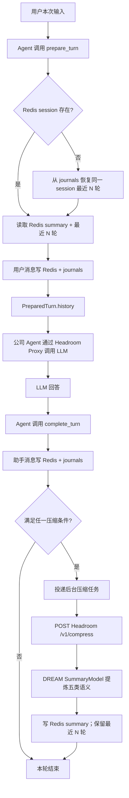
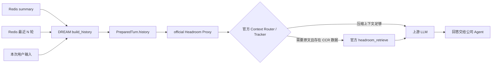

# DREAM Short-Term Memory

`short-term-memory` 分支实现 DREAM 的短期记忆边界：用 Redis 保存当前
`user_id + session_id` 的在线上下文，用 journals 保存完整对话事件，在达到
PLAN 规定的阈值后异步调用官方 Headroom 服务压缩，并把可供下一轮使用的短期
summary 写回 Redis。

DREAM 是供公司 Agent 调用的记忆组件，不负责实现聊天 HTTP 路由，也不直接调用最终
回答模型。公司 Agent 在回答前向 DREAM 取得 history 和 Headroom Proxy 参数，完成模型
调用后再把助手回答写回 DREAM。


## 这条分支解决什么问题

```text
当前会话原文           Redis Session Context
完整对话事件           journals JSONL
上下文 token 优化      official Headroom Proxy
五类短期语义摘要       DREAM 注入的 SummaryModel
最终回答               公司 Agent / LLM
```

本分支只覆盖 PLAN.md 的短期记忆相关设计，主要对应：

- 2.3 在线链路轻，离线链路重。
- 3.1 Redis Session Context 与 journals 写入。
- 3.2 默认读取 Redis 当前 session。
- 5.1 读记忆链路。
- 5.2 写记忆链路。
- 5.3 Redis 短期上下文。
- 5.4 Headroom 压缩。
- 11 Redis session 与 journals 生命周期。

本分支不实现历史会话列表/UI、Memory Retrieval Skill、中长期 Wiki Hydration、用户画像、
AI 决策卡或 Daily Memory Job。这些能力不能用来判断本分支的短期记忆链路是否完成。

## 当前实现结论

| 能力 | 状态 | 当前证据与边界 |
|---|---|---|
| 按 `user_id + session_id` 隔离 Redis 上下文 | 已实现 | `RedisSessionContext` 使用独立 messages/summary key |
| 最近 N 轮读取与 history 组装 | 已实现 | `summary + Headroom 压缩消息（未过期时）+ 最近 N 轮 + 本次输入` |
| 用户/助手消息写 Redis 和 journals | 已实现 | `prepare_turn` 写用户消息，`complete_turn` 写助手消息 |
| Redis 半天 TTL | 已实现 | 默认 `43200` 秒，每次消息写入刷新 messages 和 summary TTL |
| Redis 过期后按 session 从 journals 恢复 | 已实现 | 在线只恢复最近 N 轮，更早内容投递后台重建，不把全量日志塞回回答链路 |
| 优先读取持久化 summary snapshot | 部分实现 | `SummarySnapshotReader` 接口和测试存在；默认 runtime 尚未装配 Redis 之外的 snapshot reader |
| PLAN 三类 Headroom 触发条件 | 已实现 | token 比例、消息数、session 时长任一达到阈值即排队 |
| 回答后异步调用 `/v1/compress` | 已实现 | `ExecutorHeadroomCompressionQueue` 不阻塞下一次在线读取 |
| Headroom 自动选择压缩器 | 已接入 | DREAM 不指定 Router、Kompress、SmartCrusher 等内部实现；由官方服务决定 |
| 五类短期摘要写 Redis | 已实现 | 注入的 SummaryModel 提取目标、偏好、事实、未完成事项、附件引用 |
| 压缩结果参与下一轮读取 | 已实现 | Headroom 返回的 messages 原样保存到 summary envelope，在 CCR TTL 内加入 history |
| LLM 读取短期记忆 | 接口已实现 | `PreparedTurn.history` 和 OpenAI-compatible Proxy URL 交给公司 Agent；DREAM 不生成最终回答 |
| 官方 CCR 相关性判断与原文召回 | 部分实现 | 已保持同一匿名 scope、保留官方 marker 并让真实模型请求经过 Proxy；真实供应商下的自动工具续跑仍需验收 |

因此，对“是否已经实现记忆存储、压缩、召回、读取”的准确回答是：

- **存储：已实现。** Redis 保存在线短期状态，journals 保存完整事件。
- **压缩：已实现 DREAM 侧触发、调用、保存和失败处理。** 实际压缩能力取决于运行中的官方 Headroom 服务。
- **读取：已实现。** Agent 可在回答前取得 Redis 组装后的 history。
- **召回：已完成官方 Proxy 接入边界，但不能写成已全部验收。** 当前还需要用真实公司 Agent 的模型请求验证 Headroom 是否能在发现压缩信息不足时透明调用 `headroom_retrieve`、取回原文并继续生成回答。

## 总体流程

### 回答前、回答后与后台压缩



这个位置对应“上一轮结束后预计算下一轮上下文”为主的策略：下一轮通常只需读取已经
准备好的 summary 和最近消息，不在用户等待路径里重新压缩整个历史。若公司 Agent 的本次
实际请求仍然过长，请求本身继续经过 Headroom Proxy，由官方 Proxy 在模型调用路径中做
上下文优化；DREAM 不再实现第二套压缩算法。

### 下一轮 LLM 如何读取和召回



这里存在两种不同的“恢复/召回”，不要混为一谈：

1. **Redis session 恢复**：Redis key 过期后，DREAM 根据 `user_id + session_id` 从
   journals 恢复最近 N 轮。这是 DREAM 已实现的可靠路径。
2. **Headroom CCR 召回**：官方 Headroom 对自己缓存的被压缩原文进行相关性判断、工具
   注入、检索和模型续跑。DREAM 只保持官方 messages/marker、匿名稳定 scope，并让真实
   LLM 请求经过同一 Proxy，不自行实现 CCR 缓存或 `headroom_retrieve`。

单独调用 `/v1/compress` 只能证明“压缩接口工作”，不能证明“LLM 已自动召回并继续回答”。
CCR 还要求：本次压缩实际产生可召回数据、缓存仍在 TTL 内、真实模型请求经过同一
Headroom Proxy 和 scope，并且供应商路径支持透明工具续跑。

## Redis Session Context

### Key

PLAN 中的逻辑名 `session:{id}:summary` 在实现中增加了用户隔离前缀：

```text
dream:session:{user_id}:{session_id}:messages
dream:session:{user_id}:{session_id}:summary
```

- `messages`：Redis List，按时间顺序存当前 session 消息。
- `summary`：Redis String，保存 DREAM 短期摘要 envelope。
- 默认 TTL：`43200` 秒，即 12 小时。
- 写入消息时，以 Redis transaction pipeline 同时追加消息并刷新 TTL。
- summary 只属于当前 session，不写 Wiki，也不是长期事实源。

### Summary envelope

Headroom 负责 token 压缩，不负责保证 PLAN 要求的五类语义结构。因此后台任务在
Headroom 之后调用注入的 SummaryModel，生成：

```json
{
  "user_id": "user-001",
  "session_id": "session-001",
  "coverage": {
    "processed_message_count": 120
  },
  "current_goal": [],
  "preferences": [],
  "confirmed_facts": [],
  "pending_items": [],
  "attachment_references": [],
  "compression_context": {
    "messages": [],
    "tokens_before": 10000,
    "tokens_after": 6000
  },
  "updated_at": "2026-08-04T12:00:00+00:00"
}
```

`compression_context.messages` 只保存 Headroom 实际应用压缩时返回的 conversation
messages，DREAM 不解析或重写其中的 Router/CCR 信息。如果 Headroom 返回 `router:noop`，
DREAM 仍可由 SummaryModel 生成五类语义摘要，但不会在 envelope 中复制一份未压缩的完整
transcript。

### 在线读取规则

`prepare_turn` 的读取顺序是：

1. 检查指定 `user_id + session_id` 是否仍在 Redis。
2. Redis 已过期时，从 journals 恢复该 session 最近 N 轮。
3. 读取 Redis summary。
4. summary 中的 Headroom 压缩 messages 未超过 CCR TTL 时，将其加入 history。
5. 追加 Redis 最近 N 轮原文。
6. 追加本次用户输入并返回 `PreparedTurn.history`。

在线默认读取不扫描 Wiki、raw 或 source。journals 也只在 Redis session 不存在的恢复场景
进入链路，不是每轮回答的默认数据源。

## Headroom 压缩

### DREAM 决定何时调用

每轮助手回答写入后，DREAM 检查三类 OR 条件：

```text
estimated_tokens >= context_window_tokens * trigger_ratio
OR message_count >= max_messages
OR session_seconds >= max_session_seconds
```

- `trigger_ratio` 必须在 `0.60`–`0.70` 之间，默认 `0.65`。
- 默认消息阈值为 `100`。
- 默认 session 时长阈值为 `14400` 秒。

DREAM 只决定“什么时候需要优化”，不指定 Headroom 应使用 Kompress、SmartCrusher、日志
压缩器或其他 transform。官方 Headroom Router 根据消息类型和安全策略决定具体压缩过程；
`router:noop` 是有效成功响应，但表示本次没有减少 token。

### Headroom 决定如何压缩和 CCR

后台任务调用：

```http
POST {HEADROOM_SERVICE_URL}/v1/compress
Content-Type: application/json
X-Headroom-User-Id: <HMAC scope>
X-Headroom-Session-Id: <HMAC scope>
X-Headroom-Project-Id: <HMAC scope>

{
  "model": "gpt-4o",
  "messages": [
    {"role": "user", "content": "..."},
    {"role": "assistant", "content": "..."}
  ]
}
```

DREAM 保持 message boundary，不把整个 Redis session 拼成一个大字符串；返回 messages
也原样进入短期 summary envelope。用户和 session 原始标识不会发送给 Headroom，三个
scope header 使用 HMAC 去标识化，并在后台压缩与实时 Agent 请求之间保持稳定。

### 失败处理

- development：Headroom 不可用、超时或响应非法时允许 no-op fallback，记录 warning，
  SummaryModel 可使用原消息生成短期摘要。
- production：Headroom 失败时不调用 SummaryModel、不写 Redis summary、不 LTRIM，保留
  Redis 原始消息和 journals，并进入后台重试边界。
- 日志和 failure reason 只记录错误类别，不记录完整用户对话。

## journals 的职责

journals 是 append-only JSONL 事件日志，不是 Wiki 长期事实，也不直接参与正常在线回答。
消息按用户、日期和 session 分文件：

```text
{DREAM_HOME}/{user_id}/journals/{YYYY-MM-DD}-{session_id}.jsonl
```

它承担三件事：

- Redis 可过期，因为用户/助手原文已经同步写入 journals。
- 用户重新进入一个已过期 session 时，可恢复最近 N 轮。
- 更早内容可交给异步 Headroom/summary 重建，不阻塞在线请求。

与负责长期记忆的模块对接时，对方应读取 journals 做 Daily Memory Job 和
Persistence Classifier；短期记忆模块不把 Redis summary 直接写入 Wiki。

## 公司 Agent 的 Python 调用边界

### 1. 组装 runtime

公司环境需要注入 token estimator、五类摘要模型、后台 executor 和 retry queue：

```python
from concurrent.futures import ThreadPoolExecutor
from pathlib import Path

from dream.api.redis_runtime import RedisRuntime
from dream.api.short_term_runtime import build_short_term_runtime
from dream.config import load_settings

settings = load_settings(Path(".env"))
redis_runtime = RedisRuntime.connect(settings.redis_session.url)

runtime = build_short_term_runtime(
    home=Path(settings.home).expanduser(),
    settings=settings,
    redis_client=redis_runtime.client,
    token_estimator=company_token_estimator,
    summary_model=company_session_summary_model,
    executor=ThreadPoolExecutor(max_workers=2),
    retry_queue=company_background_retry_queue,
)
```

这里的 `company_session_summary_model` 负责输出 PLAN 五类摘要；它不是最终回答模型。

### 2. 回答前读取 DREAM

```python
prepared = runtime.conversation_handler.prepare_turn(
    user_id="user-001",
    session_id="session-001",
    content="继续刚才的 Redis 设计",
    session_seconds=1800,
)
```

`prepared.history` 已包含当前可用的 Redis 短期记忆与本次输入；
`prepared.headroom_proxy_url` 是当前实现提供的 OpenAI-compatible `/v1` 地址，
`prepared.headroom_headers` 是匿名稳定 scope。

### 3. 真实 LLM 请求经过 Headroom Proxy

```python
from openai import OpenAI

client = OpenAI(
    base_url=prepared.headroom_proxy_url,
    api_key=company_model_api_key,
    default_headers=prepared.headroom_headers,
)
response = client.chat.completions.create(
    model=company_model,
    messages=list(prepared.history),
    tools=company_agent_tools,
)
assistant_text = response.choices[0].message.content or ""
```

这一步必须经过官方 Proxy，才具备由 Headroom 注入/处理 CCR 工具的条件。DREAM 不应先
直接调用模型、再把结果送给 Headroom。

### 4. 回答后写回 DREAM

```python
result = runtime.conversation_handler.complete_turn(
    prepared,
    assistant_content=assistant_text,
)
```

`result.headroom_queued` 表示 DREAM 是否因 PLAN 三类条件而投递后台压缩，不表示
Headroom 一定应用了某个 transform；真实结果需要查看 telemetry 或 Headroom stats。

## 配置

复制 `.env.example` 后，短期记忆只需要关注以下变量：

```dotenv
DREAM_HOME=~/.dream
DREAM_ENV=development

DREAM_REDIS_URL=redis://127.0.0.1:6379/0
DREAM_REDIS_SESSION_TTL_SECONDS=43200
DREAM_REDIS_HISTORY_TURNS=10
DREAM_CONTEXT_WINDOW_TOKENS=128000
DREAM_HEADROOM_TRIGGER_RATIO=0.65
DREAM_HEADROOM_MAX_MESSAGES=100
DREAM_HEADROOM_MAX_SESSION_SECONDS=14400

HEADROOM_SERVICE_URL=http://127.0.0.1:8787
HEADROOM_SERVICE_TIMEOUT_SECONDS=300
HEADROOM_COMPRESSION_MODEL=gpt-4o
HEADROOM_CCR_TTL_SECONDS=43200

DREAM_OPTIMIZATION_SCOPE_SECRET=replace-with-a-production-secret
```

`DREAM_ENV=production` 时必须配置 `HEADROOM_SERVICE_URL` 和非默认
`DREAM_OPTIMIZATION_SCOPE_SECRET`，否则配置加载失败；系统不会因漏配置而静默降级。

## 本地安装和启动

### 1. 安装 DREAM

```bash
python3.13 -m venv .venv
.venv/bin/python -m pip install -e ".[dev]"
```

不要把 Headroom 安装进 DREAM 的 `.venv`。Headroom 是可替换的独立组件，建议使用
`uv tool` 的隔离环境：

```bash
uv tool install --python 3.13 "headroom-ai[proxy,ml]==0.33.0"
```

如果本机已经安装 `headroom-ai[all]==0.33.0`，无需重复安装；`all` 只是包含更多可选
能力，DREAM 当前只依赖 HTTP Proxy 和可用压缩能力。

### 2. 启动 Redis

```bash
docker compose -f compose.redis.yml up -d
redis-cli -u redis://127.0.0.1:6379/0 ping
```

预期：`PONG`。

### 3. 启动 Headroom

```bash
HEADROOM_CCR_TTL_SECONDS=43200 headroom proxy \
  --host 127.0.0.1 \
  --port 8787 \
  --mode token
```

DREAM 不固定 `--compressor` 或 `--target-ratio`，让官方 Headroom 自动选择 transform。

在另一个终端检查：

```bash
curl -s http://127.0.0.1:8787/health
headroom doctor
```

对普通文本使用 Kompress 时，`/health` 中应看到 `checks.kompress.status=healthy`；首次请求
可能触发 lazy initialization。单条很短的消息返回 `router:noop` 是正常现象，不能用它
判断长 session 压缩失败。

## 验证

### 不依赖外部服务的短期记忆测试

```bash
PYTHONPATH=src .venv/bin/python -m pytest -q \
  tests/api/test_conversation_handler.py \
  tests/api/test_redis_session_context.py \
  tests/headroom/test_session_compression.py \
  tests/integrations/test_headroom_client.py \
  tests/application/test_short_term_runtime.py
```

这些测试验证 Redis key/TTL、读写顺序、journals 恢复、三类触发条件、后台压缩、summary
写入、production 失败保护、匿名 scope 和 Agent Proxy 边界。

### 真实 Redis

```bash
DREAM_RUN_REDIS_INTEGRATION=1 \
DREAM_REDIS_URL=redis://127.0.0.1:6379/15 \
PYTHONPATH=src .venv/bin/python -m pytest -q -s \
tests/integrations/test_redis_session_context.py
```

### 真实 Headroom 自动路由

```bash
DREAM_RUN_HEADROOM_AUTO_ROUTING=1 \
HEADROOM_SERVICE_URL=http://127.0.0.1:8787 \
PYTHONPATH=src .venv/bin/python -m pytest -q -s \
tests/headroom/test_headroom_auto_routing.py
```

### 官方 Proxy CCR 验收

```bash
DREAM_RUN_HEADROOM_PROXY_CCR=1 \
DREAM_HEADROOM_BINARY="$HOME/.local/bin/headroom" \
PYTHONPATH=src .venv/bin/python -m pytest -q -s \
tests/headroom/test_headroom_proxy_ccr_flow.py
```

这个测试必须验证完整链路，而不只是 token 下降：

1. Proxy 对上下文进行了真实压缩。
2. 模型侧发现需要压缩前的原文。
3. 官方 Headroom 处理 `headroom_retrieve`。
4. Proxy 自动继续上游请求并得到最终回答。

当前不能把第 3–4 步写成已通过；只有该 opt-in 验收在目标 Headroom 版本和真实公司模型
供应商路径上成功后，CCR 才能从“部分实现”改为“已验收”。

## 关键代码位置

| 职责 | 文件 |
|---|---|
| Redis session、history、journals 恢复、触发策略 | `src/dream/api/conversation_handler.py` |
| Agent-facing runtime 装配 | `src/dream/api/short_term_runtime.py` |
| redis-py 连接生命周期 | `src/dream/api/redis_runtime.py` |
| Headroom `/v1/compress` HTTP 适配器 | `src/dream/integrations/headroom_client.py` |
| 后台压缩、五类 summary、Redis 写入 | `src/dream/memory/session_compression.py` |
| journals JSONL | `src/dream/storage/journal_store.py` |
| 去标识化 Headroom scope | `src/dream/api/optimization_scope.py` |
| 配置 | `src/dream/config.py` |

更详细的实现说明见 [docs/short-term-memory.md](docs/short-term-memory.md)。

## 当前明确限制

- DREAM 不调用最终回答模型；只有公司 Agent 接入后才能完成真实回答链路。
- 当前 `PreparedTurn.headroom_proxy_url` 直接提供 OpenAI-compatible `/v1` 路径；若公司
  Agent 使用 Anthropic 原生 SDK，需要在 Agent adapter 中使用 Headroom 服务根 URL。
- Redis 之外的持久化 summary snapshot 只有读取接口，默认 runtime 尚未装配；Redis 和
  summary 同时过期时，当前可靠恢复源是 journals。
- Headroom CCR 缓存有 TTL，不能替代 journals 的长期、精确、可审计原文。
- 不是每次 Headroom 压缩都会产生 CCR marker；`router:noop` 或不带 marker 的结果不能
  通过 CCR 恢复。DREAM 不伪造 marker，也不自行实现私有召回协议。
- 历史会话 UI、跨 session 中长期记忆检索和 Wiki 写入不属于本分支。
