# DREAM 短期记忆：Redis + Headroom

本分支只提交 DREAM 短期记忆链路：Redis Session Context、journals 原文事件、
Headroom 后台压缩、Redis session summary，以及公司 Agent 通过同一 Headroom Proxy
发起真实模型请求的调用边界。



## 范围

包含：

- 以 `user_id + session_id` 隔离 Redis messages 和 summary。
- Redis 默认 12 小时 TTL；每次写入刷新 messages/summary TTL。
- 在线读取仅组装 `summary + 最近 N 轮 + 本次用户输入`。
- 用户消息、助手消息同步追加到 Redis 和 journals。
- Redis 过期后，从 journals 恢复同一 session 最近 N 轮；更早内容异步重建。
- 每轮结束后由 DREAM 检查三类条件：上下文达到窗口 60%–70%、消息数超限、
  session 持续时间超限。任一满足才投递后台 Headroom 压缩。
- Headroom `/v1/compress` 输出原样保存在 Redis summary envelope；DREAM 不解析
  ContentRouter、压缩器类型或 CCR marker。
- 公司 Agent 的实际 OpenAI/Anthropic 请求经过同一 Headroom Proxy，并携带稳定、
  匿名的 session scope。官方 Headroom 负责自动路由与 CCR。
- Headroom 是可替换的 HTTP 组件，DREAM 不 `import headroom`，也不包含模型文件。

本分支不新增或修改：历史会话列表/分页窗口、Memory Retrieval Skill、Hot Memory、
Wiki Hydration、AI 决策卡、用户画像、Daily Memory Job 或长期 Wiki 持久化。

## Redis 存储

Redis key：

```text
dream:session:{user_id}:{session_id}:messages
dream:session:{user_id}:{session_id}:summary
```

`messages` 是按顺序追加的 JSON 消息列表；`summary` 是 DREAM 的结构化 JSON envelope，
包括五类 session 语义和 Headroom 返回的 conversation-preserving messages：

```text
current_goal
preferences
confirmed_facts
pending_items
attachment_references
compression_context.messages
```

完整对话原文始终保存在 journals。Redis summary 只是短期缓存，不写 Wiki，也不是长期
事实源。压缩上下文超过 `HEADROOM_CCR_TTL_SECONDS` 后不再交给 Agent；语义 summary
仍可使用，并从 journals 异步重建旧上下文。

## 配置

```dotenv
DREAM_ENV=development
DREAM_REDIS_URL=redis://127.0.0.1:6379/0
DREAM_REDIS_SESSION_TTL_SECONDS=43200
DREAM_REDIS_HISTORY_TURNS=10
DREAM_CONTEXT_WINDOW_TOKENS=128000
DREAM_HEADROOM_TRIGGER_RATIO=0.65
DREAM_HEADROOM_MAX_MESSAGES=100
DREAM_HEADROOM_MAX_SESSION_SECONDS=14400

HEADROOM_SERVICE_URL=http://127.0.0.1:8787
HEADROOM_SERVICE_TIMEOUT_SECONDS=300
HEADROOM_COMPRESSION_MODEL=gpt-4o
HEADROOM_CCR_TTL_SECONDS=43200
DREAM_OPTIMIZATION_SCOPE_SECRET=replace-with-a-production-secret
```

production 必须配置 `HEADROOM_SERVICE_URL` 和
`DREAM_OPTIMIZATION_SCOPE_SECRET`。development 允许 Headroom 不可用时 no-op fallback；
production 失败时不写 summary、不裁剪 Redis，保留 Redis 原始消息和 journals 等待重试。

## 启动依赖

Redis：

```bash
docker compose -f compose.redis.yml up -d
```

Headroom 作为独立工具安装并启动：

```bash
uv tool install --python 3.13 "headroom-ai[all]==0.33.0"

HEADROOM_CCR_TTL_SECONDS=43200 headroom proxy \
  --host 127.0.0.1 \
  --port 8787 \
  --mode token
```

DREAM 不固定 `--compressor` 或 `--target-ratio`；ContentRouter 自动选择可用压缩器。

## 公司 Agent 调用边界

```python
from concurrent.futures import ThreadPoolExecutor
from pathlib import Path

from openai import OpenAI

from dream.api.redis_runtime import RedisRuntime
from dream.api.short_term_runtime import build_short_term_runtime
from dream.config import load_settings


settings = load_settings(Path(".env"))
redis_runtime = RedisRuntime.connect(settings.redis_session.url)

runtime = build_short_term_runtime(
    home=Path(settings.home).expanduser(),
    settings=settings,
    redis_client=redis_runtime.client,
    token_estimator=company_token_estimator,
    summary_model=company_session_summary_model,
    executor=ThreadPoolExecutor(max_workers=2),
    retry_queue=company_background_retry_queue,
)

# 回答前：读取 Redis，必要时从 journals 恢复，并写入本轮用户消息。
prepared = runtime.conversation_handler.prepare_turn(
    user_id="user-001",
    session_id="session-001",
    content="继续刚才的 Redis 设计",
    session_seconds=1800,
)

# 最终模型请求由公司 Agent 发起，并经过官方 Headroom Proxy。
client = OpenAI(
    base_url=prepared.headroom_proxy_url,
    api_key=company_model_api_key,
    default_headers=prepared.headroom_headers,
)
response = client.chat.completions.create(
    model=company_model,
    messages=list(prepared.history),
    tools=company_agent_tools,
)

# 回答后：助手原文写 Redis + journals；满足三类条件时异步压缩。
runtime.conversation_handler.complete_turn(
    prepared,
    assistant_content=response.choices[0].message.content or "",
)
```

`PreparedTurn` 返回的 scope 是 HMAC 去标识化值，不把 `user_id`、`session_id` 原文发送
给 Headroom。后台 `/v1/compress` 与实时 Proxy 请求使用同一 scope，使 Headroom 能在其
官方能力范围内维护同一上下文与 CCR。

## 测试

默认测试不要求 Redis 或 Headroom 进程：

```bash
PYTHONPATH=src python -m pytest -q
```

真实 Redis：

```bash
DREAM_RUN_REDIS_INTEGRATION=1 \
DREAM_REDIS_URL=redis://127.0.0.1:6379/15 \
PYTHONPATH=src python -m pytest -q -s \
tests/integrations/test_redis_session_context.py
```

真实 Headroom 自动路由与 CCR：

```bash
DREAM_RUN_HEADROOM_AUTO_ROUTING=1 \
HEADROOM_SERVICE_URL=http://127.0.0.1:8787 \
PYTHONPATH=src python -m pytest -q -s \
tests/headroom/test_headroom_auto_routing.py

DREAM_RUN_HEADROOM_PROXY_CCR=1 \
DREAM_HEADROOM_BINARY="$HOME/.local/bin/headroom" \
PYTHONPATH=src python -m pytest -q -s \
tests/headroom/test_headroom_proxy_ccr_flow.py
```

真实验收失败时应记录 Headroom 供应商边界；DREAM 不自行实现 CCR marker、缓存、
`headroom_retrieve` 或模型续跑。
